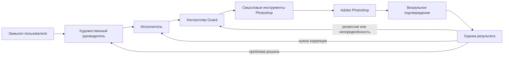
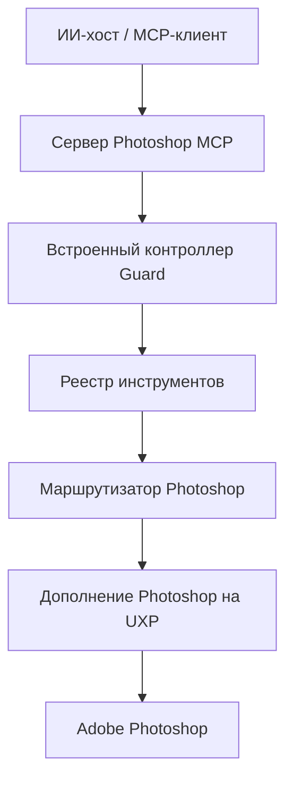

# Photoshop MCP — Digital Painting Edition

[English](README.md) · **Русский**

Независимо поддерживаемая система на базе MCP для управляемого ИИ-рисования и проверяемой автоматизации Adobe Photoshop.

> Проект не связан с Adobe и не является официальной версией исходного Photoshop MCP. Историческое происхождение, лицензирование и границы самостоятельной разработки описаны в [NOTICE](NOTICE).

## Зачем существует этот проект

Большинство систем, умеющих работать с Photoshop, решают задачу на уровне команд: создать слой, провести линию, применить фильтр, сохранить файл. Для автономного рисования этого недостаточно.

После каждого изменения остаются более трудные вопросы:

- действительно ли изображение стало лучше;
- увидел ли агент результат в подходящем масштабе;
- не разрушило ли локальное исправление композицию целиком;
- что делать, если Photoshop выполнил действие, но ответ MCP потерялся;
- когда детализация развивает форму, а когда только маскирует слабую конструкцию;
- как продолжать работу, не теряя уже достигнутых качеств.

Digital Painting Edition строится вокруг **замкнутого контура визуального контроля**, а не вокруг количества доступных команд.



Внутренние названия двух устойчивых ролей в коде и технической документации — **Art Director** и **Painter**. В русской документации дальше используются переводы **художественный руководитель** и **исполнитель**. Английские названия упоминаются только там, где важно связать текст с конкретным системным объектом.

## Пять ключевых идей

### 1. Художественная работа — не последовательность примитивов

Технически корректный прямоугольник ещё не является зданием, несколько окружностей — формой головы, а нанесённая текстура — моделировкой объёма.

Поэтому система старается двигаться от крупных визуальных отношений к мелким:

```text
узнаваемость
→ композиция и большие массы
→ силуэт и конструкция
→ светотеневая организация
→ форма
→ края и материал
→ избирательная детализация
→ финальная очистка
```

Подробнее: [Методика автономного рисования](docs/ru/painting-method.md).

### 2. Успешная команда не равна успешному художественному решению

Проект разделяет по меньшей мере три разных факта:

1. Photoshop выполнил операцию;
2. пиксели действительно изменились;
3. изменение решило поставленную визуальную проблему.

Большое изменение пикселей может означать серьёзную ошибку. Небольшое изменение может быть удачной тонкой коррекцией. Поэтому художественный результат нельзя выводить только из технического успеха команды.

Подробнее: [Как работает система](docs/ru/how-it-works.md).

### 3. Визуальное подтверждение зависит от масштаба вопроса

Композицию нельзя надёжно оценивать по маленькому фрагменту. Шов, ореол или дефект края трудно увидеть на уменьшенном изображении всей картины.

Контроллер Guard использует три уровня наблюдения:

```text
КОМПОЗИЦИЯ → ОБЪЕКТ → МИКРОДЕТАЛЬ
```

Кадр целиком сохраняется всегда, а локальные фрагменты добавляются только тогда, когда они действительно нужны.

Подробнее: [Адаптивная визуальная проверка](docs/ru/visual-verification.md).

### 4. Неопределённую операцию нельзя просто повторить

Если Photoshop уже выполнил мазок, но ответ MCP потерялся, повтор команды способен нанести тот же мазок второй раз.

Базовая модель восстановления:

```text
изменение
→ ответ потерян
→ НЕ повторять изменение вслепую
→ прочитать сохранённое состояние / подтверждение / изображение
→ сопоставить фактическое состояние с ожидаемым
→ продолжить из подтверждённой точки
```

Такой подход в технических материалах называется **no-replay** — отказом от слепого повтора.

Подробнее: [Guard, восстановление и отказ от слепого повтора](docs/ru/guard-and-recovery.md).

### 5. Адаптация без переобучения весов модели

Проект не заявляет, что «самообучает» базовую языковую модель в смысле дообучения её весов (**fine-tuning**, то есть дополнительного обучения уже готовой модели).

Вместо этого система накапливает структурированное состояние во время работы:

- какие проблемы ещё не решены;
- какие стратегии уже дали слабый результат;
- какие состояния изображения приняты как надёжные точки возврата;
- какие кисти и отпечатки реально дают нужный тип следа;
- какой документ, слой и набор доступных возможностей сейчас являются авторитетными.

Подробнее: [Память и адаптация во время работы](docs/ru/runtime-adaptation.md).

## Архитектура

Поддерживаемый рабочий маршрут смысловых операций Photoshop рассчитан на **Windows и UXP**. UXP — это современная платформа расширений Adobe Photoshop.



Если необходимый модуль UXP недоступен или несовместим, операция должна завершиться предсказуемой ошибкой **до изменения документа**, а не тихо переключиться на другой механизм исполнения.

Подробное техническое описание: [docs/architecture.md](docs/architecture.md).

## Что уже есть в проекте

Проект включает:

- смысловой набор инструментов Photoshop;
- обязательный контролируемый путь для изменяющих операций;
- дополнение Photoshop на UXP;
- привязку операций к конкретному документу и слою;
- компактные планы визуальных изменений;
- разделение ролей художественного руководителя и исполнителя;
- обязательную визуальную проверку после значимых изменений;
- три уровня проверки: композиция, объект и микродеталь;
- журнал операций;
- восстановление без слепого повтора;
- надёжные точки возврата к ранее принятому состоянию;
- настройку кистей и работу с наборами кистей;
- профилирование кистей и отпечатков по фактическому визуальному следу;
- механизмы против механического копирования одного и того же отпечатка;
- измерение задержек и стоимости визуальной проверки;
- репозиторные и живые проверки с реальным Photoshop.

Актуальный список инструментов и их технические свойства генерируется в [docs/available-tools.md](docs/available-tools.md), поэтому в этом обзорном тексте намеренно нет вручную закреплённого числа инструментов.

## Что проект не заявляет

Проект **не** утверждает, что:

- базовая языковая модель переобучается во время рисования;
- технический успех команды автоматически доказывает художественное качество;
- модульные тесты способны заменить человеческую художественную оценку;
- большее количество автономных действий всегда лучше;
- высокая детализация автоматически означает более сильную работу;
- большой локальный фрагмент всегда полезнее изображения целиком;
- система уже эквивалентна обученному художнику.

Часть художественных выводов принципиально требует оценки человеком и так и помечается в документации о приёмке.

## Исследовательские вопросы

Помимо практической автоматизации Photoshop, проект исследует более общие вопросы агентных систем:

- как визуальный агент должен выбирать масштаб наблюдения;
- как отличать техническое выполнение от реального визуального успеха;
- как восстанавливаться после неопределённого изменения внешней программы;
- как уменьшать число обращений к модели, не разрушая контроль;
- как хранить опыт без переобучения модели;
- как не путать текстуру и детализацию с развитием формы;
- как оценивать инструмент по его фактическому поведению, а не только по названию;
- как проверять художественные системы с помощью контрольных примеров и независимой человеческой оценки.

Краткое резюме: [Инженерные и исследовательские находки](docs/ru/findings.md).

Отдельный пример того, как живой художественный тест превращается в изменение архитектуры процесса:
[Как живой тест изменил процесс: перспектива и цвет](docs/ru/process-revision-perspective-color.md).

## Русская документация

Рекомендуемый порядок чтения:

1. [Как работает система](docs/ru/how-it-works.md)
2. [Методика автономного рисования](docs/ru/painting-method.md)
3. [Адаптивная визуальная проверка](docs/ru/visual-verification.md)
4. [Guard, восстановление и отказ от слепого повтора](docs/ru/guard-and-recovery.md)
5. [Память и адаптация во время работы](docs/ru/runtime-adaptation.md)
6. [Инженерные и исследовательские находки](docs/ru/findings.md)
7. [Как живой тест изменил процесс: перспектива и цвет](docs/ru/process-revision-perspective-color.md)
8. [Как предлагается оценивать систему](docs/ru/evaluation.md)

Полный индекс: [docs/ru/README.md](docs/ru/README.md).

## Техническая документация

Для разработчиков и проверки конкретных контрактов:

- [Architecture](docs/architecture.md)
- [Available tools](docs/available-tools.md)
- [Digital painting implementation index](docs/digital-painting.md)
- [Visual evaluation](docs/visual-evaluation.md)
- [Performance and latency](docs/performance-and-latency.md)
- [Acceptance matrix](docs/roadmap-final-acceptance-matrix.md)
- [Development](docs/development.md)

Эти документы пока остаются техническими и англоязычными. Русская папка предназначена прежде всего для понимания методики и устройства системы.

## Какие визуальные материалы стоит добавить

Первая русская редакция намеренно не использует выдуманные примеры «до и после». Для публичной версии особенно полезны будут четыре типа реальных материалов:

1. **Пустой холст → итоговая работа** — демонстрация конечного результата.
2. **Слабое промежуточное состояние → исправленное** — доказательство работы методики, а не только красивого финала.
3. **Кадр целиком → объект → микродеталь** — реальный пример многоуровневой проверки.
4. **Потерянный ответ → восстановленное состояние** — инженерный пример безопасного восстановления.

Лучше сопровождать изображения не рекламной подписью, а объяснением: какую проблему видела система, какое действие выбрала и какое наблюдение изменило следующее решение.

## Статус и доказательства

Будущие задачи находятся в [PAINTING-ROADMAP.md](docs/PAINTING-ROADMAP.md), а состояние уже принятых и ещё не закрытых требований — в [roadmap-final-acceptance-matrix.md](docs/roadmap-final-acceptance-matrix.md).

Историческое происхождение и авторство: [NOTICE](NOTICE). Лицензия: MIT.
