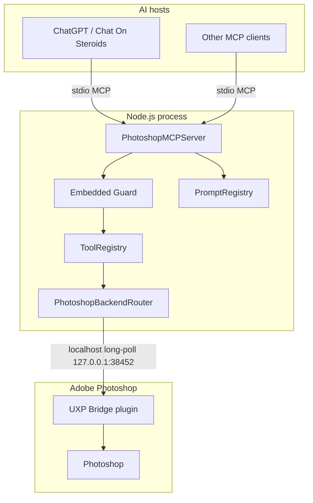

# Architecture

## Same-chat pixel review — 2026-10-05 source update

The existing inline/exact-image review asks the Painter in the same chat to inspect actual BEFORE/AFTER
against the original brief/style, identify the largest visible defect and choose a construction change.
Existing previous_observation fields store the critique; the next pass acts on it. Pass gain, task/stage
readiness and whole-image finish remain distinct. This self-review is not independent artistic acceptance.
Production no longer creates, loads, calls or waits for a local vision evaluator. Stored historical local
assessments do not override current observations. Exact image delivery and no-replay rules remain intact.
See [workflow and experimental history](artistic-evaluator.md); activation/live quality acceptance is pending.


Engineering source of truth for **Photoshop MCP — Digital Painting Edition**: host integration,
embedded Guard, semantic tool dispatch, UXP transport, preview/evidence flow, prompt layer and the
MCP host boundary.

← Back to [README](../README.md)

**Maintainer:** [lavalava45](https://github.com/lavalava45)
**Historical origin/licensing:** [`NOTICE`](../NOTICE) and [`LICENSE`](../LICENSE)

## 1. Architectural goals

The project is a local-first MCP bridge between AI hosts and Adobe Photoshop. The architecture is
designed around four constraints:

1. Photoshop workflow safety belongs to this repository, not to host-specific internals.
2. Mutations are durable, recoverable and evidence-bound rather than blindly retryable.
3. Production semantic Photoshop dispatch is **UXP-only and fail-closed**.
4. The host-facing contract stays small enough that Chat On Steroids or another MCP host can evolve
   independently.

The canonical Chat On Steroids route is:

```text
ChatGPT
  ↓
Chat On Steroids Plugins
  ↓ stdio
dist/cos-plugin.js
  ↓
embedded Guard
  ↓ internal ToolRegistry dispatch
PhotoshopBackendRouter
  ↓ UXP only
Photoshop UXP companion
  ↓
Adobe Photoshop
```

The former external Core/controller/daemon provider chain and all external-script Photoshop execution
transports are retired. The maintained host platform is **Windows only**. Windows-specific code is
limited to Photoshop installation/version discovery; all semantic Photoshop reads and mutations use
the UXP bridge and fail closed when that bridge is unavailable.

For ordinary MCP clients, `src/index.ts` exposes the same server and semantic catalog. The dedicated
`src/cos-plugin.ts` entry sets `PHOTOSHOP_GUARD_MODE=required`, making the guarded mutation lane
mandatory while leaving known read-only tools directly callable.

Async Guard workers run inside that MCP process. Job journals survive interruption; the worker
does not survive the host closing the stdio transport. CoS PluginManager owns the persistent
connection through start, poll and final review. One-request shell pipelines are unsuitable for
async painting; restore the installed plugin when its route is unavailable, without another server.
After lost execution, inspect/reconcile existing receipts and fresh state; never replay the package.
The existing pre-dispatch document-bounds validation covers anchors and absolute Bezier handle
pairs, including region clip_bounds. Negative handle offsets fail the public schema; all independent
coordinate defects join the existing not-executed rejection, before layer preparation or mutation.

## 2. System overview



| Layer | Responsibility | Key paths |
| --- | --- | --- |
| MCP core | protocol, tool/prompt registry, session lifecycle | `src/core/` |
| Embedded Guard | durable journal, barriers, jobs, recovery, artistic workflow state | `src/core/guard/`, `src/tools/guard-tools.ts` |
| Semantic tools | 132 public non-recipe `photoshop_*` tools | `src/tools/`, core connection/Guard tools |
| Backend router | production UXP-only semantic dispatch | `src/platform/photoshop-backend.ts` |
| UXP bridge | Photoshop-side execution and exact outcomes | `src/platform/uxp-bridge-client.ts`, `uxp-plugin/` |
| Prompt layer | server instructions and 5 MCP guide prompts | `src/prompts/` |
| Errors | structured error envelopes for recovery | `src/errors/` |

## 3. MCP server and public surface

`PhotoshopMCPServer` is implemented in `src/core/photoshop-mcp-server.ts`; `src/core/server.ts` is the
stable compatibility facade. The server wires the official MCP SDK to:

- **132 semantic tools**, including 15 public Guard tools;
- **5 MCP guide prompts**;
- server-level instructions published during MCP initialization;
- structured error wrapping with machine-readable error codes and suggested next actions;
- version/capability reporting;
- document-target propagation for document-bound operations.

The legacy `photoshop_recipe_*` execution layer is removed. Multi-step work is composed from
semantic tools, Guard-owned compact passes and guide prompts rather than a parallel recipe runtime.

### Prompt layer

`src/prompts/host-guidance.ts` owns host-facing bootstrap guidance; `src/prompts/instructions.ts` is a
compatibility facade. The guidance covers session initialization,
semantic-tool selection, user-intent terminology, capability-aware fallback, disambiguation,
guide-prompt discovery, export conventions and recovery behavior.

Five templates are registered by the canonical `src/prompts/prompt-catalog.ts`; the historical
`src/prompts/registry.ts` path remains a compatibility facade:

| Prompt | Purpose |
| --- | --- |
| `ps.gradient_blend` | Fade a subject into a background via a mask gradient |
| `ps.color_correct` | Tone / contrast correction guide |
| `ps.dodge_burn_guide` | Non-destructive dodge/burn setup |
| `ps.composite_blend` | Asset placement + mask + blend guidance |
| `ps.digital_painting_control` | Canonical subject-agnostic painting-control discipline |

The state/capability/preview primitives are part of the semantic tool surface rather than a separate
prompt subsystem. Prompt registration is verified by:

```bash
npm run verify:photoshop-prompts
```

Tool and Guard counts are verified from source rather than trusted from hand-written documentation:

```bash
npm run verify:tool-counts
```

## 4. Guard ownership and mutation contract

The host owns transport and presentation concerns; the Guard owns Photoshop workflow safety.

### Host responsibilities

The host may know:

- whether an assistant message rendered in the user-visible UI;
- how structured progress is presented;
- tool discovery and MCP/process transport;
- conversation/session presentation and host lifecycle.

Those capabilities may improve UX and auditability, but Photoshop correctness does not depend on
them.

### Guard responsibilities

The embedded Guard owns:

- admission of the next mutation;
- immutable operation identity and replay protection;
- durable operation journal and controller locking;
- async job start/poll/recovery;
- document pinning and document-incarnation checks;
- preview barriers and visual-verdict requirements;
- exact evidence identity and reconciliation;
- significance/replan rules;
- checkpoint deadlines;
- Art Director / Painter state;
- multiscale review debt;
- accepted artistic anchors and exact restore/reconcile semantics;
- durable status/resume state.

`dist/cos-plugin.js` enables `PHOTOSHOP_GUARD_MODE=required`. In this mode the model can inspect
raw semantic schemas for planning, but a direct public mutation fails closed with
`guard_required`. The Guard calls the underlying handler internally only after durable preflight
succeeds.

### Compact hot loop

Normal painting continuation uses one compact Guard call per semantic pass:

```text
next_pass
  ↓
photoshop_guard_cycle_auto
  ↓
Guard preflight + internal semantic dispatch
  ↓
materialized visual evidence
  ↓
model inspection
  ↓
previous_operation_id + previous_observation + next_pass
```

The compact caller describes artistic intent and the next bounded pass. Technical execution
receipts and acknowledgement state remain durable internal Guard data; the model does not copy
protocol tokens in the normal loop.

If an async operation finishes but its final poll response is lost,
`photoshop_guard_status` / `photoshop_guard_resume` recover the exact pending operation and
evidence identity. Recovery restores evidence and state; it does **not** authorize replay of the
mutation.

### Art Director / Painter

The Guard also owns a two-level artistic controller:

- **Art Director**: whole-image assessment, global priorities, bounded task queue and review horizon;
- **Painter**: bounded local/medium semantic passes under the active directive/task.

Painter work cannot silently escape delegated change domains. Completion of the review cadence,
task completion or a serious local/global conflict sets review debt and blocks further Painter
dispatch until Art Director review.

### Postcondition verification

An executor result of `success` is evidence, not universal proof that the intended world state
changed. Current Guard invariants include:

- visual mutations require materialized after-evidence;
- visual acceptance binds to the exact artistic frame/evidence identity;
- PSD checkpoints require a real non-empty file;
- uncertain dispatched work cannot be blindly replayed;
- reconciliation evidence must be fresh and belong to the same pinned document/incarnation;
- crop evidence becomes stale when its bound whole-frame identity, document identity or requested
  region changes.

Where a result is exactly machine-readable, tool-specific state readback should be preferred over
inferring success from dispatch alone.

### Continuation watchdog

The Guard distinguishes:

- `workflow_stall` — activity continues but meaningful visual progress does not;
- `decision_loop_stall` — the visual barrier is clear but no healthy next pass follows for the
  configured advisory window;
- `silent_stall` — a non-ready continuation remains unresolved with no durable job advancing it.

Routine schema/status/source reads do not count as semantic progress merely to keep an abandoned
workflow looking alive.

## 5. Guard protocols and capability negotiation

Current durable/internal protocol families include:

- `photoshop.guard.operation_receipt.v1` — exact completed-operation evidence;
- internal acknowledgement/recovery state consumed behind the compact facade;
- `operation.progress.v1` — transport-neutral semantic progress;
- `photoshop.guard.capabilities.v1` — capability negotiation rather than host-version pinning;
- `photoshop.guard.review_escalation.v1` — durable multiscale evidence escalation.

`cos.host_progress.v1` remains only a compatibility alias for hosts that can promote structured
progress into native UI rows.

The Guard is intentionally capability-driven. Host version numbers are not a safety contract.

## 6. Production Photoshop transport

Production semantic Photoshop dispatch is **UXP-only / fail-closed**.

`src/platform/photoshop-backend.ts` is the routing authority. `PhotoshopBackendRouter` configures
the UXP backend only. If required UXP readiness is missing or its bridge revision is incompatible,
semantic dispatch fails with a deterministic capability/readiness error such as
`uxp_bridge_unavailable`; the operation is not replayed through ExtendScript/COM.

The UXP companion provides DOM, `batchPlay`, Imaging API and persistence capabilities across the
current catalog:

- document and layer lifecycle;
- state, layer, history and selection reads;
- selections, masks and transforms;
- adjustments, filters, text, Smart Objects and styles;
- painting marks, brush configuration and color sampling;
- crop/resize, guides, image placement and export;
- preview reads and non-interfering save/checkpoint operations.

Document-bound operations fail closed on target mismatch. The explicit
`photoshop_set_active_document` tool is the navigation operation; document-bound mutations do not
silently switch tabs to satisfy a stale `document_id`.

The bridge server binds only to `127.0.0.1:38452`. The currently live-tested Photoshop 2026 UXP
runtime rejects narrower loopback network declarations in the plugin manifest, so the companion
manifest uses the broader permission required by that runtime while the actual server listener
remains loopback-only.

## 7. Preview and visual-evidence pipeline

`photoshop_get_preview` returns a standard MCP `image` content block plus metadata. The default
standalone preview request remains:

```json
{
  "max_dimension_px": 1024,
  "quality": 8
}
```

The source document is not modified.

### Whole-frame and focus evidence

For local inspection, the same call can request a crop in **source-document coordinates**:

```json
{
  "max_dimension_px": 1000,
  "focus_region": { "left": 420, "top": 180, "right": 760, "bottom": 520 },
  "focus_max_dimension_px": 1200
}
```

The canonical whole-document frame remains the top-level preview and whole-frame identity. The
focus crop is additional evidence. Overview downscaling never changes the document-space
coordinates used for planning or verification.

For terminal-oriented local tooling, `materialize_path` may write the generated JPEG to an
absolute path. In `PHOTOSHOP_GUARD_MODE=required`, model-facing
`photoshop_get_preview` calls default to `include_image=false` and receive an automatic
runtime materialization path; `include_image=true` is an explicit opt-in for direct image
delivery. Materialization is an evidence-delivery option, not another Photoshop export/save
workflow.

The compact Guard hot loop is evidence-bound: `photoshop_guard_cycle_auto` delivers the
complete set of required exact review images **inline** when they fit its bounded MCP image
block/byte budget, recording the durable delivery receipt. For oversized or incomplete
bundles it returns SHA/path/dimensions/crop references and explicitly lists the missing
roles. `photoshop_guard_job_poll` is reference-only. Request only missing roles via
`photoshop_guard_review_image`, which verifies registered file identity before delivering
their exact bytes; do not repeat an already successful inline review delivery. Visual
closure remains fail-closed until all required review roles have delivery receipts and
the Painter supplies an actual observation.

At the final model-facing MCP boundary, textual/structured binary fields are semantically
redacted (`base64`, image `data`, data-URLs and byte arrays). Guard results also expose
`estimated_context_bytes`; responses above the context warning threshold include a
`large_model_facing_response` warning. This boundary does not remove explicit MCP image
content from `photoshop_guard_review_image` or inline `photoshop_guard_cycle_auto` delivery.

### Multiscale Guard review

Before a visual pass, the Guard resolves the minimum required review level:

| Level | Evidence |
| --- | --- |
| **COMPOSITION** | whole-frame context; Guard target long edge 1600 px |
| **OBJECT** | whole-frame context + exact source-document focus crop, target 1200 px |
| **MICRO** | whole-frame context + exact local evidence, target 1600 px |

These are Guard review targets, not global defaults for `photoshop_get_preview`.

Small/local/detail work and `subtle_local` significance still obey the stronger local
before/after evidence contract where applicable.

All requested/effective regions remain expressed in Photoshop document pixels. Context padding is
deterministic and clamped only at canvas boundaries.

### Read-only escalation without mutation replay

`previous_observation.review_findings[]` may identify a structured OBJECT/MICRO issue with exact
document-space `region_bounds`. If current evidence is insufficient, the Guard:

1. keeps the original artistic operation pending;
2. persists review debt against its operation/document/whole-frame identity;
3. captures only the required read-only focus evidence;
4. returns that evidence through the same `visual_review` path;
5. blocks closure and the next visual mutation until the evidence is classified.

Escalation does not mint a second artistic mutation and does not replay the original one.
Materialization proves artifact identity; delivery metadata proves that evidence was supplied for
review. Neither by itself proves that the model interpreted the pixels correctly.

The broader rationale, experimental hypotheses and practical evaluation protocols live in
[visual-evaluation.md](visual-evaluation.md).

## 8. Semantic tool model

The public `photoshop_*` catalog contains fine-grained and orchestration-level semantic
operations for documents, layers, selections, masks, transforms, adjustments, filters, text,
history, state, preview, painting, measurement and Guard workflows.

The authoritative tool list, schemas and generated backend/access classification are documented in
[available-tools.md](available-tools.md) and verified from source.

VisualMicroPlan and compact Guard payload examples are protocol fixtures, not artistic recipes or
allowlists. Runtime capability discovery and the current ToolRegistry decide what is executable.

## 9. Error and recovery contract

`src/errors/` normalizes failures into structured envelopes with stable error codes and recovery
hints. The intended control flow is:

```text
intent
  ↓
Guard/tool preflight
  ↓
semantic dispatch
  ↓
exact outcome or bounded uncertainty
  ↓
fresh state / preview evidence when needed
  ↓
reconcile, replan or continue
```

The important architectural rule is that ambiguous execution is resolved from durable state and
fresh evidence. It is not converted into a second mutation attempt.

## 10. Host independence

Two optional host capabilities can strengthen observability without becoming Photoshop safety
dependencies:

### Verified assistant-message delivery receipt

A host-created message id/text hash/render timestamp can prove that particular completion prose
appeared in the UI. This is useful audit evidence but is not required to authorize Photoshop work.

### Structured semantic progress

A generic versioned progress object can let a host render human-readable progress without
Photoshop-specific logic. Useful fields include a stable progress id, operation id, state/revision
and semantic text.

If a future host cannot support the single-process embedded Guard model, an external transparent
MCP proxy remains a theoretical fallback. No external proxy is a production dependency today.

## 11. Repository layout

```text
photoshop-mcp-digital-painting/
├── src/
│   ├── core/              # MCP server, Guard, registries, durable state
│   ├── platform/          # UXP bridge client, detection and bounded platform support
│   ├── tools/             # semantic Photoshop and Guard tools
│   ├── prompts/           # server instructions + guide prompts
│   └── errors/            # structured error envelopes
├── docs/                  # architecture, policy, acceptance and references
├── uxp-plugin/            # Photoshop-side UXP companion
└── scripts/               # verification, benchmarks and release tooling
```

## 12. Design principles

1. **Local-first** — Photoshop execution and project state remain local.
2. **Guard before mutation** — workflow safety is enforced independently of host behavior.
3. **Evidence before replay** — uncertain state is reconciled, not duplicated.
4. **UXP-only production transport** — unavailable capability fails closed.
5. **Pinned targets** — document identity cannot silently drift.
6. **Whole-frame context with adaptive local evidence** — local correctness does not erase global
   awareness.
7. **Capability negotiation over host-version pinning** — host upgrades do not redefine Photoshop
   safety.
8. **Semantic bundles over transport chatter** — one bounded artistic thought should not require a
   collection of bookkeeping calls.

## 13. Validation and related sources of truth

Important verification entry points:

```bash
npm run verify:photoshop-prompts
npm run verify:tool-counts
npm run verify:compact-v2-contract
npm run verify:canonical
```

Related current documents:

- [Digital painting agent skill](digital-painting-agent-skill.md) — runtime artistic-control kernel;
- [Digital painting implementation index](digital-painting.md) — mapping from painting concepts to code;
- [Available tools](available-tools.md) — public tool reference plus generated backend/access inventory;
- [Painting roadmap](PAINTING-ROADMAP.md) — forward-looking work only;
- [Final acceptance matrix](roadmap-final-acceptance-matrix.md) — accepted/pending evidence status;
- [Visual evaluation](visual-evaluation.md) — multiscale review rationale, experiments and human evaluation protocols;
- [Ownership, provenance and retirement](ownership-and-retirement.md) — current ownership decisions plus P1-A/P2 retirement history.

## 14. Project provenance

This repository is maintained and released independently as **Photoshop MCP — Digital Painting
Edition**. Historical origin, the source-independence comparison baseline, upstream distribution
separation and retained MIT attribution are documented centrally in [`NOTICE`](../NOTICE). Runtime,
build and packaging do not depend on an upstream checkout or remote.
