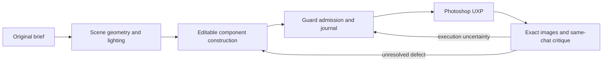

# English documentation

[Русская версия](../ru/README.md) · [Project README](../../README.md)

> **Status: 10 October 2026.** These articles explain PaintPilot's architecture,
> artistic method, observed failures and unresolved acceptance. Source-level
> implementations and green tests are not a claim of independently verified
> artistic quality. Consult the [roadmap](../PAINTING-ROADMAP.md) for open gates.

## Reading paths

**Start here:** [How it works](how-it-works.md) →
[Painting method](painting-method.md) →
[Engineering findings](findings.md) →
[Perspective and color case study](process-revision-perspective-color.md).

**Reliability:** [Guard and recovery](guard-and-recovery.md) →
[Visual verification](visual-verification.md) →
[Runtime adaptation](runtime-adaptation.md).

**Evidence and evaluation:** [Evaluation methodology](evaluation.md) →
[Case study](process-revision-perspective-color.md).

## Articles

| Article | Main question |
| --- | --- |
| [How it works](how-it-works.md) | How a brief becomes bounded Photoshop edits and evidence-bound review |
| [Painting method](painting-method.md) | How recognition, construction, light, materials and selective detail develop |
| [Guard and recovery](guard-and-recovery.md) | How uncertain execution, ownership and rollback avoid blind replay |
| [Visual verification](visual-verification.md) | How whole-frame and local crops remain tied to the same operation |
| [Runtime adaptation](runtime-adaptation.md) | What a painter can retain without training model weights |
| [Engineering findings](findings.md) | Recurrent design lessons, boundaries and falsifiable hypotheses |
| [Perspective and color case study](process-revision-perspective-color.md) | How a railway error changed the scene contracts |
| [Evaluation](evaluation.md) | How to compare quality, reliability, efficiency and generalization |

## Present implementation

The original demonstrations predate several implemented mechanisms:
durable scene geometry and applicable quantitative preflight; versioned
scene lighting/color and provenance; independent editable object components,
smooth contours and authored IK constraints; bounded reference-guided
painterly strokes; exact-image review and same-chat whole-scene Critic
checkpoints. See the engineering specifications for
[object construction](../object-construction.md),
[painterly strokes](../painterly-strokes.md), and
[artistic review](../artistic-evaluator.md).

## Historical illustrations

All ten JPEGs in [the Russian image folder](../ru/images/) are **historical
visual records**, not newly rendered demonstrations of the current code.
We reuse their exact pixels rather than silently retouching evidence. Some
figures contain original Russian labels and explanatory overlays; English
captions in these articles translate their intended meaning.

| Images | What they illustrate | What they do not prove |
| --- | --- | --- |
| Snow temple; homestead | Recognition block-in, compositional choices, rejected experiment and restore | Present-day realism or finished-image quality |
| Railway scenes | Perspective mismatch, causal rework, lighting, whole-frame vs object crop | Universal live acceptance of scene-geometry/color contracts |
| Sphere; brush samples | Coarse form preceding detail and visibly different preset footprints | Automatic anatomy or successful painterly synthesis on arbitrary images |

The newest mathematical construction and stroke features have dedicated
contract tests; their **independent artistic acceptance is still open**.

## Terminology and evidence

*Art Director* chooses global priorities; *Painter* makes bounded causal
edits; *Guard* preserves technical contracts, state and recovery.
*Pass* is one testable artistic hypothesis; *brief* is the original request;
*crop* is evidence from a document-space area; *accepted anchor* is a
verified restoration point; *no-replay* forbids repeating uncertain work.
These terms are consistent across both languages.

Keep distinct: **implemented**, **regression-tested**, **live-tested in
Photoshop**, **judged by an independent human**, and **hypothesized**.
An operation receipt cannot stand in for any of the latter criteria.
