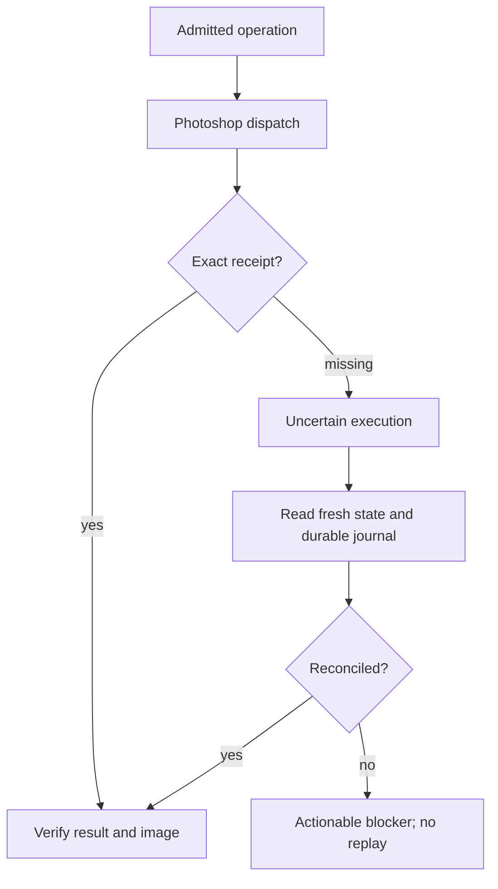

# Guard, recovery and the prohibition on blind replay

[Русский](../ru/guard-and-recovery.md) · [English contents](README.md)

## Connection and asynchronous passes

The canonical route is the managed Chat On Steroids Plugins connection
to this project's MCP child, embedded Guard and the Photoshop UXP
companion. The plugin manager maintains one MCP process from dispatch
through job polling and final review. The in-process worker does
not survive premature stdio-process termination, even though
operation journals can survive. A one-shot shell client is therefore
not a replacement for the managed async route. After lost contact,
inspect the durable receipts and reconcile the current document;
**never blindly replay** the suspected mutation.

Bezier handles are absolute canvas-pixel `[x,y]` coordinates:
`left` enters the anchor and `right` exits it. Applicable preflight
validates anchors, curve geometry and clip bounds before painting;
nonfinite coordinates fail. A handle may extend beyond the canvas
if the actual curve stays valid. Geometric preflight is not itself
a complete native brush-footprint or painterly-quality guarantee.

## Recent recovery and review contracts

An initial isolated layer fill can establish a blank canvas without
inventing perspective or material models. Compound scene construction
still requires appropriate ownership, stage and geometric evidence.
The compiler can infer uniquely determined non-authoritative
classifications from executable actions, but must not guess ambiguous
intent or grant destructive permission from prose. A known owner may
inherit its durable layer and rollback facts only when those facts
are unambiguous.

An ordinary continuation combines the previous observation with
the next pass; technical nonvisual closure can be derived from an
exact receipt. Artistic uncertainty is distinct from uncertain
execution and does not authorize an undo or replay.

## Why Guard exists

Guard enforces identity, safety, exact evidence, ownership and
recovery; it does **not** choose aesthetic taste or a compulsory
realistic style. The Art Director chooses the scene's geometry,
lighting and color hypotheses. Guard validates consistency of
the model that was actually accepted.

After a timeout three distinct outcomes are possible: Photoshop
never received the operation; it executed but its reply was lost;
or execution is partially known. A transport error alone does
not distinguish these cases.

## 1. Why replay is dangerous

```text
stroke dispatched → stroke applied → response lost
→ naïve retry → unintended duplicate stroke
```

Uncertain work demands state reconciliation, not automatic mutation.

## 2. Durable operation lifecycle

```text
request → preflight → reserved operation → dispatch
→ exact result / unknown → exact image delivery
→ grounded observation → technical and visual closure
```

Every significant operation has a unique durable identity. A resumed
session works out what happened to **that operation**, rather than
creating a new one with equivalent parameters.

## 3. Exact results and honest uncertainty

Useful evidence includes a native executed/not-executed receipt,
fresh document identity, Photoshop history, a registered exact frame,
and the persistent operation journal. Missing or contradictory
evidence must not silently become either success or permission
to retry.

## 4. Recovery flow



## 5. Technical success is not artistic closure

A completed command does not prove that shape, materials, scene or
composition improved. Visual operations retain review debt until
the exact image is delivered and an actual observation is supplied.
Same-chat critique is not an independent aesthetic verdict.

## 6. Document identity

The target must match the pinned document and its current
incarnation. A reused numeric document id or a changed active
tab is not permission to paint somewhere else. Recovery also
checks physical layers and semantic owners.

## 7. Accepted anchors and bounded undo

An accepted anchor is a registered, reviewable restoration point.
When an experimental pass worsens the image, a verified native
undo or accepted-anchor restore may be preferable to cosmetic
patching. Native-history step counts and exact boundary
correspondence must be proven. Unproven Smart Filter history
cannot be described as safely rolled back.


*The two Russian captions mean “Rejected hypothesis” and “Return to
accepted state.” This single historical example does not establish
universal rollback support.*

## 8. Preserve the meaning of work

Recovery needs more than the pixels: retain the original brief,
current Director task, unresolved whole-frame critique, protected
features, independent layer ownership, deferred reconstruction,
accepted anchors and pending review debt.

## 9. Do not rename a failed strategy

Minor color/opacity/quantity changes to the same failed causal
approach are not necessarily a new strategy. Durable strategy
fingerprints and escalation can require a truly different
construction, owner, scale, geometry or method. Exhaustion
must yield a concrete blocker or explicitly independent work,
not infinite near-identical retries.

## 10. Fail closed, do not invent a fallback

If the UXP route is down, automatic migration to a different
mutating backend risks duplicating uncertain work. Restore
the supported route, check the bridge revision, and reconcile
any in-flight operation before continuing.

## 11. General lesson

External creative applications need semantic operation identity,
fresh state, receipts and explicit no-replay—not just transport
retries. Safe uncertainty handling is a technical capability;
artistic success must still be judged separately.

## Video, checkpoints and metrics

The process-video tooling records actual attempted operations and
associated commentary in a unified export layout. A missing
commentary sidecar may be reconstructed only from preserved manifest
intent/outcome, with missing success explicitly marked unconfirmed.
Timeline/subtitle timestamps and saved PSD checkpoints do not
assert that the painting is artistically finished.
