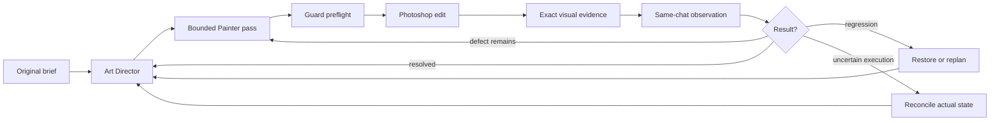

# How the system works

[Русский](../ru/how-it-works.md) · [English contents](README.md)

## Planning, execution and direct image criticism

The Painter makes edits. The Art Director tracks priorities and proposed
plans, but is not an independent image evaluator. On ordinary review the
same ChatGPT conversation receives the registered BEFORE/AFTER images and
is asked to assess visible form, proportions, perspective, lighting and
style against the original brief. The main mismatch determines the next
specific construction change. Repeating an ineffective strategy and
substituting texture for missing structure is not acceptable.
Pass success, Planner-task closure, stage closure and completion of the
whole painting are separate states. The former automatic local-model
evaluator is not in the production path; self-review is **not** independent
artistic acceptance. See [the Critic contract](../artistic-evaluator.md).

## In brief

Photoshop is an external editor with durable, mutable state, not a stateless
collection of commands. Every meaningful edit must be reconciled with
what actually happened:

The next action follows verified evidence, not merely the preceding plan.

## 1. A brief is not a list of objects

Consider a quiet snow-covered temple at night. Simply listing roofs,
lanterns, snow, statues and sky does not establish a coherent painting.
The Art Director must organize a focal point, large tonal masses, spatial
depth, recognition cues and protected visual achievements.

*Historical test frame: warm central lighting contrasted against a cold,
symmetrical courtyard. It illustrates visual relationships, not current
photorealistic quality or independent final acceptance.*

## 2. Art Director versus Painter

The Art Director decides scene interpretation, priority, current stage,
strategy changes, and the boundary at which overall review is required.
The Painter receives a narrower hypothesis: for example, distinguish
the central buildings from the distance without disturbing the principal
light accent. This decomposition makes failures attributable.

## 3. One causal artistic pass

A pass is neither one brush dab nor an entire painting stage. It may
build a shadow mass, correct a silhouette, separate depth planes, suppress
mechanically repeated stamps, soften secondary edges, or add convincing
contact shadow. It may compile several Photoshop actions, but it must
remain one bounded, reviewable artistic hypothesis.

*Historic railway run. The comparison illustrates a causal edit; image
change alone does not establish overall artistic improvement.*

## 4. Guard compiles and protects the work

Guard pins the correct document incarnation and layer ownership, checks
pending review/recovery debts, journals unique operation identity,
rejects unsafe or inconsistent geometry, blocks replay, and binds exact
visual evidence to the edit. The Art Director chooses artistic geometry
and style; deterministic geometry helpers and Guard validate the
**chosen** constraints without imposing realism on graphic styles.

Today this includes source-backed scene models, quantitative geometric
preflight for applicable passes, and component-level authored object
construction. The mathematical result is not proof of convincing anatomy.

## 5. One production Photoshop route

Semantic painting mutations use the UXP companion. A missing or mismatched
companion is a readiness problem, not permission to replay the same
mutation through COM, ExtendScript or an alternate MCP server.
The managed Chat On Steroids Plugins child keeps the asynchronous MCP
worker alive across dispatch, polling and final review.

## 6. Whole-frame and local visual evidence

The whole-image review normally uses a bounded-resolution Photoshop
Imaging API preview, not a raw full-resolution transfer. A local crop
is added when needed; both share document-space coordinates and exact
operation/document/frame identity. A stale crop is not current evidence.

*Historic railway evidence: yellow rectangle marks the requested region;
the lower panel displays its object-scale crop. The original image contains
Russian labels.*

For a fitting set, `photoshop_guard_cycle_auto` can deliver exact review
images inline. Otherwise `photoshop_guard_review_image` delivers only
missing roles. A SHA and a successful transport receipt establish neither
perception nor artistic success.

## 7. Observation versus execution

“The tool succeeded” is a technical report. A visual observation should
instead say what changed and what remains unresolved—for example, a
clearer silhouette whose lower edge still merges with the background.
The Painter must supply that observation before further visual mutation.

## 8. Why state matters

Active document and layer, selection, brush settings, Photoshop history,
accepted anchors, pending jobs, deferred construction, Critic findings
and visual-review debt are all stateful. A continuation must use fresh
authoritative state, not assume the previous model message was executed.

## 9. Decision boundaries

| Layer | Responsibility |
| --- | --- |
| Language model / Painter / Critic | Interpret the brief, select bounded changes, assess received pixels |
| Art Director | Global intent, priorities, task horizon and re-review |
| Geometry, color and imaging helpers | Calculations and consistency of authored models |
| Compiler and Guard | Valid executable plan, journal, ownership, safety, recovery |
| Photoshop UXP | Actual document mutation and native result |
| Independent human review | External judgement of visual quality |

No single layer proves overall artwork success.

## 10. A generalizable agent problem

The same problem occurs in Blender, CAD, DAWs, video editors, IDEs and
browsers: how should an agent act when an external operation is costly
or unsafe to repeat, the program retains state, and observation is
incomplete? Photoshop provides a demanding practical testbed.
