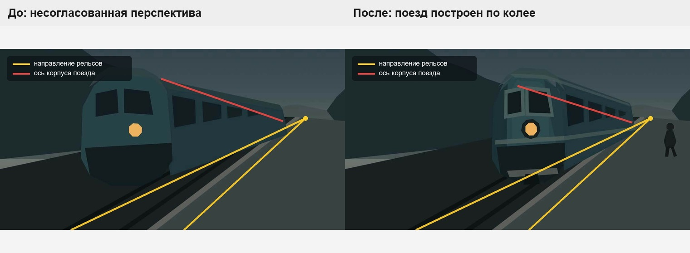
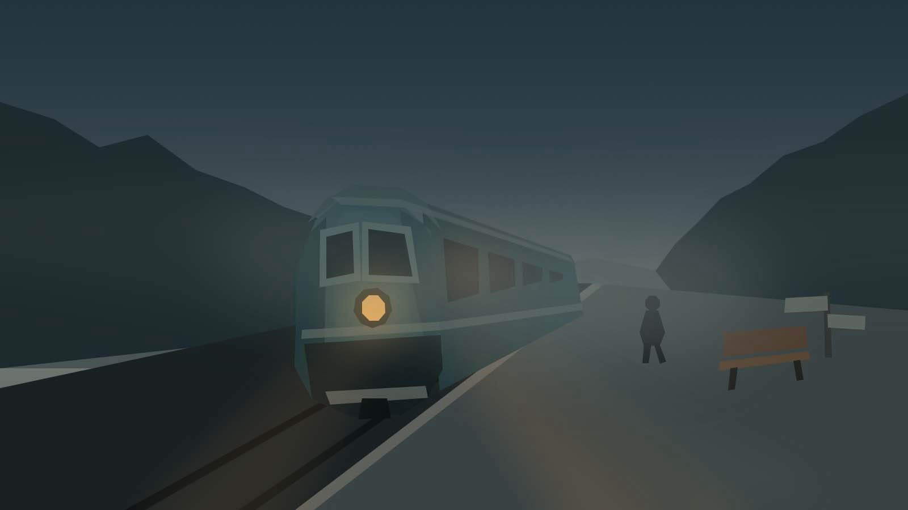
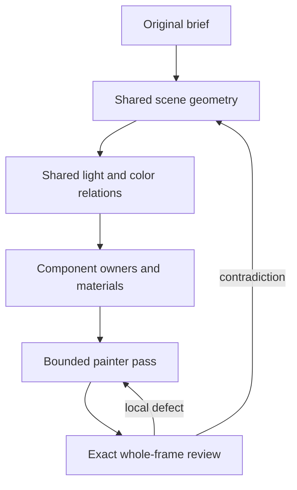

# How a live test changed the process: perspective and color

[Русский](../ru/process-revision-perspective-color.md) · [English contents](README.md)

> **Historical case study, updated 10 October 2026.** These are actual
> examples of problems discovered in an earlier railway painting run,
> not evidence that the current Geometry Preflight or lighting/color
> model has already passed full live artistic acceptance. Today the
> same-chat Painter/Critic observes registered exact images; the old
> automatic local evaluator was removed.

Useful development follows a loop:

```text
live image → visible defect → identify the causal system weakness
→ revise the engineering contract → test the revised rule
```

## From a local error to a shared spatial problem

In a foggy railway-station scene, the train initially failed to
align with the rails. Moving the front of the train seemed an
adequate local correction. But then the distant part of the train
contradicted the same perspective: the train, rails and platform
were each plausible **separately**, without one governing scene
geometry model.



*The original annotated frame has Russian “before/after” headings.
Yellow lines schematically follow the rails toward a convergence
region; red lines mark the longitudinal direction of the train.
The overlay illustrates the observed defect, not output generated
by the later Geometry Preflight implementation.*

The earlier code already supported points, distances, vanishing
directions, local surface orientation, depth ordering and
dependencies. What was missing was mandatory **shared authority**
for related spatial objects. A train resting on rails should derive
its longitudinal relation from accepted rail geometry, rather
than invent its own approximate vanishing point. A rigid body
also needs constraints on multiple cross-sections and its far end,
not one convenient reference point.

The engineering response became **P1-E.18**, Scene Perspective
Model and Geometry Preflight.

### What has since been implemented

The repository now includes a revisioned, document-bound
`scene_geometry_model` and quantitative preflight that validates
applicable spatial relations before Photoshop mutation. Dependency
revisions and an explicit distinction between observed coordinates
and artistic proposals help prevent stale or unsupported bindings.
Other object-construction primitives now include explicit
component contours, rigid transforms and articulated IK chains.

This does **not** close the need for real-Photoshop validation of
all dependent transforms, perspective invalidation, source/pixel
correspondence and artistic quality. See [object construction](../object-construction.md)
and [the live acceptance roadmap](../PAINTING-ROADMAP.md).

## The same pattern appeared in color

The scene's intention was legible: cool low-chroma dusk, warm
headlight, pale distant fog, and wet concrete receiving local
warm reflections. Nevertheless, particular RGB stops for the
sky, metal, fog and wet platform could be selected separately
without enough recorded provenance or relational control.



*Historical scene after atmospheric and lighting work.
The example concerns relationships between color fields,
not a claim of physical illumination accuracy.*

The design challenge became **P1-E.19**, Scene Lighting &
Color Model. It distinguishes:

1. **Hard sources:** user-specified color, a reference sample,
   an accepted frame, an explicit emitter or deterministic derivation.
2. **Relative artistic constraints:** warmer/cooler, higher/lower
   value or saturation, focal/subordinate, fog and reflection relations.
3. **Artist-selected choices:** legitimate hues and gradients
   where the first two classes do not determine exact values.

### What has since been implemented

The current `scene_lighting_color_model` is a versioned,
document-bound structure with source-frame identity, value
structure, ambient environment, emitters, atmosphere, sampled
anchors, palette relations and intentional exceptions. The
Guard compiler checks applicable model identity, revision,
provenance and downstream bindings. This is not a physically
based lighting engine, nor proof of pleasing final colors.
Live artistic integration and broader acceptance remain open.

## Who decides, and who checks?

| Question | Owner |
| --- | --- |
| Must this scene use classical perspective? | Art Director |
| Is flat projection, isometry or expressive distortion appropriate? | Art Director |
| Which coordinates follow from the authored model? | Deterministic helpers |
| Does the new pass violate the accepted geometry? | Guard / preflight |
| Should the scene model itself change? | Art Director after visual observation |
| Is the painting convincing? | Visual reviewer / independent human assessor |

Lighting/color follows the same logic with softer aesthetic
freedom: exact sampled facts can be hard constraints, while
many color relationships and choices remain artistic.

## How the painting process changes

Earlier an agent could independently invent rails, a train,
sky, metal and fog, then try to reconcile inconsistencies at
the end. The more coherent approach is:



The shared model should eliminate accidental contradictions
without forcing one style or replacing artistic decisions.

## Why this counts as process improvement

The railway error was not simply patched in one file or
one illustration. Its failure mode was traced to existing
capabilities, missing constraints and required dependencies.
The roadmap, preflight code, regression tests and later native
acceptance gates were updated to make the cause testable.
That is runtime/process iteration, **not** training a new
language or vision model.

## What the next live test must show

With a shared geometric and lighting structure:
rebuild dependent spatial objects rather than adjusting one
visible section in isolation; distinguish sampled colors
from authored ones; inspect the whole image after local
passes; verify that current Photoshop pixels match the
accepted models; and measure whether the revised process
actually improves the final work. Contradictory evidence
must be allowed to revise the engineering rules again.
