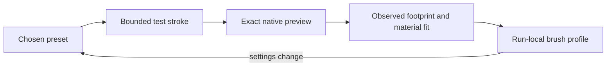

# Memory and adaptation during an art run

[Русский](../ru/runtime-adaptation.md) · [English contents](README.md)

## Review and source identity

Registered exact image evidence, current observations and the
original brief form the boundary for an artistic decision. The
current production review is performed in the same chat, with
whole-scene Critic checkpoints and retained unresolved defects;
it is not automatic external-model scoring. A new brief, document
incarnation or relevant pixel/scene revision can invalidate a
previously accepted inference.

## This is not model fine-tuning

Runtime adaptation means making decisions from structured durable
state, observations and tested constraints while model weights
remain unchanged. A previous choice does not become general
truth merely because it was stored.

## 1. What can be remembered

**Task state** includes the original brief, current stage, intent,
owners, next bounded operation and unfinished visual debts.

**Strategy history** records the problem, hypothesized cause,
attempted method, exact outcome and whether the strategy was
rejected or escalated. It supports avoiding repeated failure.

**Capabilities state** distinguishes currently connected Photoshop,
the compatible UXP bridge, available tools, brush settings and
current method readiness. A previously available capability may
not be available after a reload.

**Visual evidence** includes source-frame SHA, document incarnation,
operation identity, whole/crop bounds, explicit delivery and
grounded observations. It cannot be replaced by textual confidence.

## 2. Learning brush behavior within a run

The name of a brush preset is weaker evidence than its real stroke
footprint at the intended size and opacity. Compare hard directional
edges and broad soft grain under equivalent conditions.

*The original Russian labels identify directional hard marks on
the left and soft grainy marks on the right.*

## 3. Stamp footprints and reusable profiles

A stamp can be profiled for actual extent, transparency and
response to scale. A profile is valid for its observed conditions,
not a certificate that multiple rotated copies will appear organic.
Preset changes and altered layer/brush settings may require fresh
evidence.

## 4. Negative memory

Remember **why** a pass failed: incorrect silhouette, wrong
perspective or owner, excessive contrast, mechanical texture,
insufficient material evidence, or unsafe target identity.
New names and superficial parameter changes must not conceal
the same underlying causal strategy. This is a bounded
problem-specific constraint, not perpetual blacklisting of a
brush or a universally bad style.

## 5. Why scene coordinates do not generalize

“This preset creates a jagged edge at a small size” can inform
another trial under comparable conditions. “Start the roof at
pixel (742,318)” is a fact about one canvas, not generalized
painting knowledge. Stable general principles must be separated
from document-specific coordinates and accepted hypotheses.

Current scene geometry, lighting/color anchors, component models
and IK pose targets are **document-bound, revisioned** state.
They provide reproducibility for the active scene, not
universal object anatomy.

## 6. Accepted anchors as operational memory

An anchor identifies a frame previously accepted as sufficiently
strong to restore. A later rejected edit may be rolled back only
with supported native-history or anchor evidence; final pixel
identity must be rechecked.

*Left: rejected local hypothesis; right: return to an earlier
accepted state. This example does not prove safe rollback of
every compound Photoshop operation.*

## 7. Strategy exhaustion

A failing causal strategy should progress to a materially
different explanation, such as owner reassignment, physical
construction change, scene-level geometry or method change.
Repeated no-gain attempts can trigger a specific action
blocker rather than another cosmetic variant. The host's
autonomous Goal/Loop continuation is a separate integration
boundary: source-level tests do not prove live packaged-host
activation.

## 8. What a future learning layer would need

Longer-term generalization would require comparable samples,
source identities, controlled successes and failures, human
evaluation, drift handling and explicit scope. Merely logging
successful commands is neither dataset validation nor
machine learning.

## 9. Structured state versus an endless transcript

For the next safe step the agent needs a small authoritative
snapshot: current defect, attempted method, exact owner,
pending receipt, accepted frame, revised scene model and
required next observation. This is more useful than assuming
unstructured historical dialogue remains complete and
accurately attributed.
