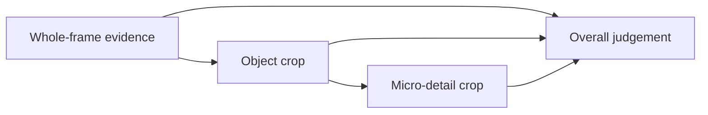

# Adaptive visual verification

[Русский](../ru/visual-verification.md) · [English contents](README.md)

## Who assesses the artwork?

The current ordinary review asks the Painter in the same ChatGPT chat to
inspect the exact delivered BEFORE/AFTER, record visible observations
and a primary mismatch, and derive a construction-based next pass.
The separate local-model evaluator is not automatically called.
Image delivery, a SHA-256, and populated observation fields do not
prove correct perception or quality. Independent artistic acceptance
is a separate task.

## One image scale cannot answer every question

A 4000×3000 canvas has different inspection needs. Composition requires
the whole image; the head's silhouette benefits from an object crop;
a four-pixel halo needs a micro-detail crop. Merely taking a screenshot
after every action is insufficient as a verification strategy.

## 1. Three levels of inspection

**COMPOSITION:** Is the overall scene readable? What attracts attention?
Are large masses and depth still coherent? Use a whole-frame image.

**OBJECT:** Is the silhouette recognizable, proportionate and in
plausible contact with its support? Are overlaps correct? Use the
whole image plus an object crop.

**MICRO:** Is there a seam, halo, edge break, repeating stamp or abrupt
tonal transition? Use whole-frame context and an appropriately
bounded local crop, escalating only if needed.

*The yellow rectangle marks the original document-space inspection
region. The lower panel is an object-level crop; its embedded label
is in Russian. This is historical railway evidence.*

## 2. Never abandon the whole image

A locally sharp correction may be harmful to the global composition.
Local evidence **adds** to the whole-frame overview; it cannot replace
it. The overview normally uses a bounded Photoshop Imaging API
representation, not an uncompressed full-size source raster.

## 3. Coordinate systems remain distinct

**Document space** is canonical, with top-left origin, X rightward
and Y downward, in original canvas pixels. **Layer space** may have
transforms and nonzero offsets; its coordinates must be explicitly
mapped into document space. **Preview space** might be a 1000×750
downscale of a 4000×3000 document; its pixels are not scene
coordinates. Photoshop UI zoom, pan and canvas rotation form a
fourth, non-authoritative **view space**.

An example crop `left=1200, top=600, right=1800, bottom=1300` means
the same original-document area regardless of preview dimensions.
The UXP imaging level is converted back to original bounds.

## 4. Every crop needs provenance

A crop should identify the operation, document incarnation, exact
whole-frame source, requested and obtained bounds, inspection level,
and its own frame identity. A crop from a previous image cannot
silently satisfy a new visual review.

## 5. Additional observation must not replay an edit

If the whole-frame image is insufficient, request more read-only
evidence for the **same** operation. Do not repeat the mutation
just to obtain a bigger image. Missing inline review roles can be
requested with `photoshop_guard_review_image`; an already delivered
exact image should not be needlessly redelivered.

## 6. Maximum resolution is not the objective

Larger image blocks cost encoding time, transport and model context,
and may still fail to answer a global question. The goal is the
**minimum sufficient registered evidence** for the given defect.
Performance experiments must separate Photoshop execution, preview
capture, encoding, transport, host scheduling and actual decision time.
Do not label uninstrumented delays as model thinking time.

The supported Imaging API read path may use a Photoshop modal
context; its current implementation does not prove that all
imaging reads universally require modal execution.

## 7. Request a specific local inspection

Use a structured issue type (such as seam halo), exact canvas-space
bounds and the required review level. An unqualified request to
“zoom in” is not a durable evidence contract.

## 8. Creation, delivery and understanding differ

1. An image was created and its file identity registered.
2. The corresponding exact bytes were delivered to the model.
3. The model produced a grounded visual interpretation.

Checksums can support (1); transport and delivery receipts support
(2). Neither proves (3). The third claim must remain reviewable
and its limitations explicit.

## 9. Compare verification policies

Compare whole-frame-only, all-scales-always and adaptive multi-scale
inspection. Record missed defects, false positives, global regressions,
transferred bytes, extra crops, unnecessary replay and agreement with
independent observers. Do not infer visual improvement from reduced
latency alone.

## 10. What machine evidence cannot settle

Computable facts include coordinate validity, crop freshness,
operation lineage, no-replay behavior and completed review-delivery
obligations. Whether a portrait is more convincing remains a
perceptual question requiring independent human judgement or a
separately calibrated evaluation method.
