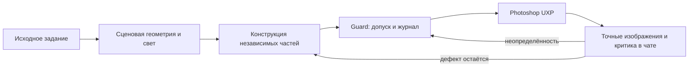

# Русская документация

[English edition](../en/README.md) · [Главная страница проекта](../../README.ru.md)

> **Состояние на 10 октября 2026 года.** Эта серия объясняет работающий
> архитектурный подход и его ограничения, а не объявляет завершённым автономное
> создание качественных картин. Текущие инженерные контракты и незакрытые
> проверки приведены в [roadmap](../PAINTING-ROADMAP.md).

Текущая архитектурная поправка: [прямой разбор BEFORE/AFTER в том же чате](../artistic-evaluator.md)
на обычном review; главный недостаток определяет следующий способ построения. Автоматический вызов
локальной модели убран. Самооценка не является независимой приёмкой; live и прирост качества ещё открыты.


Эта папка — публичный объяснительный слой проекта. Она не заменяет техническую документацию, а отвечает на другой вопрос: **почему система устроена именно так и какую проблему решает каждый её механизм**.

Основным техническим источником остаются код и документы верхнего уровня папки `docs/`.
Для новых механизмов см. также [конструкцию объектов и поз](../object-construction.md),
[живописные мазки по референсу](../painterly-strokes.md) и
[разбор изображений в том же чате](../artistic-evaluator.md).

## Что изменилось в текущей реализации

В отличие от первых художественных демонстраций, теперь реализованы
долговременная модель геометрии сцены и проверка геометрии перед исполнением
для применимых проходов; модель освещения и цвета с происхождением выбранных
значений; построение независимых компонентов объекта по контурам, связям и
IK-цепям; ограниченные живописные мазки по референсу; журнал восстановления и
критика всего кадра в том же чате. Это **реализация контрактов и тестов**, а
не подтверждение художественной убедительности изображения.



## Статус иллюстраций

Все десять растровых изображений в `images/` — **исторические материалы
конкретных тестовых сцен**, а не визуальный эталон свежего кода. Они остаются
без ретуширования, чтобы не подменять свидетельства. В некоторых сравнениях
поясняющие подписи и линии нарисованы поверх исходных кадров.

| Сюжет / изображения | Что подтверждает | Чего не подтверждает |
| --- | --- | --- |
| Храм, homestead | Узнаваемую блокировку, композицию, отклонённую гипотезу и возврат | Фотореализм или качество нового Painter |
| Железнодорожная станция | Пример ошибки перспективы, локальной коррекции, света и двух масштабов просмотра | Общую завершённость E.18/E.19 на всех сценах |
| Сфера, пробы кистей | Различие большой формы и детализации, наблюдаемые следы пресетов | Автоматическую анатомию или качество произвольных мазков |

Для современной конструктивной геометрии и кистевых алгоритмов основным
свидетельством служат [технические контракты](../object-construction.md) и
[тесты мазков](../painterly-strokes.md); реальные сравнительные картины ещё
требуют независимой художественной оценки.

## Как читать

### Быстро понять проект

1. [Как работает система](how-it-works.md)
2. [Методика автономного рисования](painting-method.md)
3. [Инженерные и исследовательские находки](findings.md)
4. [Как живой тест изменил процесс: перспектива и цвет](process-revision-perspective-color.md)

### Понять архитектуру агента

1. [Как работает система](how-it-works.md)
2. [Guard, восстановление и отказ от слепого повтора](guard-and-recovery.md)
3. [Адаптивная визуальная проверка](visual-verification.md)
4. [Память и адаптация во время работы](runtime-adaptation.md)

### Понять методику оценки

1. [Методика автономного рисования](painting-method.md)
2. [Адаптивная визуальная проверка](visual-verification.md)
3. [Оценка системы и будущие разборы](evaluation.md)
4. [Инженерные и исследовательские находки](findings.md)
5. [Как живой тест изменил процесс: перспектива и цвет](process-revision-perspective-color.md)

## Документы

| Документ | О чём |
| --- | --- |
| [Как работает система](how-it-works.md) | полный цикл: от исходного задания до Photoshop, проверки результата и следующего художественного прохода |
| [Методика автономного рисования](painting-method.md) | построение от крупного к мелкому, ловушка примитивов, развитие формы и критерии завершения |
| [Guard, восстановление и отказ от слепого повтора](guard-and-recovery.md) | журнал операций, неопределённость, восстановление, точки возврата и защита от повторения исчерпанных стратегий |
| [Адаптивная визуальная проверка](visual-verification.md) | композиция, объект, микродеталь; уменьшенные кадры, локальные фрагменты, координатные пространства и происхождение данных |
| [Память и адаптация во время работы](runtime-adaptation.md) | что система уже хранит как рабочее состояние и что может запоминать без изменения весов модели |
| [Инженерные и исследовательские находки](findings.md) | общие выводы, полученные во время разработки |
| [Как живой тест изменил процесс: перспектива и цвет](process-revision-perspective-color.md) | пример цикла: живой тест → системная причина → изменение roadmap → новый рабочий протокол |
| [Оценка системы и будущие разборы](evaluation.md) | контрольные упражнения, отрицательные примеры, человеческая оценка и структура будущих разборов работ |

## Термины

Внутри кода остаются устойчивые англоязычные имена некоторых ролей и компонентов. В русской документации они переводятся при первом употреблении:

- **Art Director** — художественный руководитель;
- **Painter** — исполнитель;
- **Guard** — защитный контроллер, отвечающий за состояние, безопасность, проверку и восстановление;
- **pass** — художественный проход;
- **brief** — исходное задание;
- **focal area / focal point** — главная зона внимания / главный зрительный акцент;
- **value** — светлотность, тон и крупные тональные массы;
- **crop** — локальный фрагмент изображения;
- **stamp** — отпечаток кисти или мотив;
- **dab** — отдельный мазок-точка;
- **blind replay** — слепой повтор уже возможно выполненной операции;
- **evidence** — подтверждающие данные: изображение, состояние, журнал или иной проверяемый результат;
- **runtime adaptation** — адаптация во время работы без переобучения весов модели;
- **holdout task** — новая контрольная задача, не использовавшаяся при настройке метода.

После первого пояснения предпочтительно используется русский вариант.

## Языковая стратегия

Сначала русская версия используется как основной объяснительный текст: здесь проще вычистить терминологию, логику и степень уверенности утверждений.

Актуальные обзорные документы публикуются параллельно на двух языках:

```text
README.ru.md        русский публичный вход
README.md           английский публичный вход

docs/ru/            русская объяснительная версия
docs/en/            английская версия этих же тем и иллюстраций
```

Для обеих версий поддерживается одинаковая карта тем; английские подписи к
историческим растрам переводятся в тексте, а исходные пиксели доказательств
не меняются.

## Принцип достоверности

Публичная документация должна различать:

- **реализовано** — механизм существует в коде;
- **проверено в репозитории** — поведение покрыто воспроизводимыми тестами;
- **проверено с реальным Photoshop** — есть живое подтверждение;
- **требует оценки человеком** — речь идёт о художественном или зрительном качестве;
- **гипотеза** — исследовательская идея, а не установленный факт.

Эта граница важнее эффектных формулировок.
