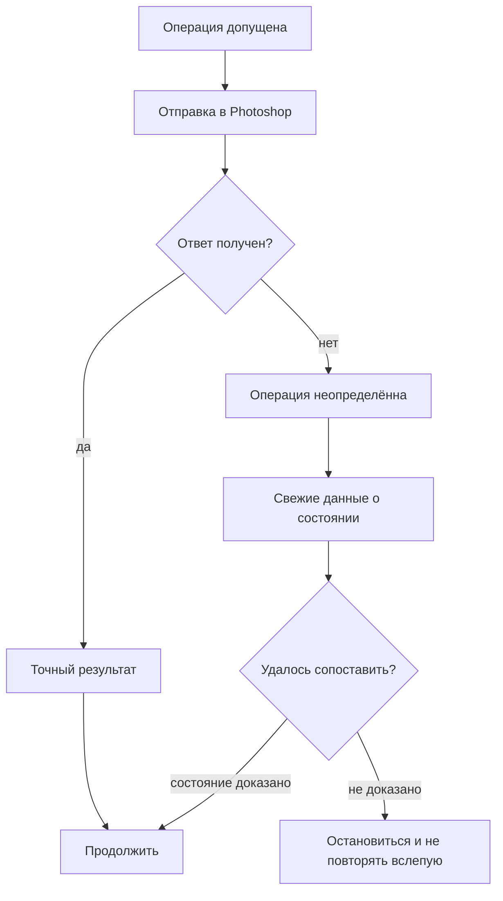

# Guard, восстановление и отказ от слепого повтора

## Зачем нужен Guard

`Guard` — внутреннее имя защитного контроллера. Он отвечает не за художественный вкус, а за состояние, безопасность, проверку результата и восстановление после сбоев.

Его граница ответственности принципиальна. Художественный руководитель решает, **какая** пространственная,
цветовая или световая гипотеза допустима для сцены. Guard не выбирает стиль и не требует реализма сам по
себе. Он следит, чтобы уже принятые ограничения были явно записаны, оставались актуальными и не нарушались
незаметно следующими операциями.

Photoshop — программа с долговременным состоянием. Если агент отправил команду и получил тайм-аут, возможны по меньшей мере три ситуации:

1. команда не дошла до Photoshop;
2. команда выполнилась, но ответ потерялся;
3. команда выполнилась частично или результат нельзя уверенно классифицировать.

Наивный повтор объединяет эти случаи в один:

> Не получил ответ — повторю.

Для рисования это опасно.

## 1. Почему повтор может испортить документ

Представим обычный мазок:

```text
мазок отправлен
→ Photoshop выполнил мазок
→ ответ потерялся
→ агент повторил команду
→ на холсте уже ДВА мазка
```

Поэтому важный принцип проекта:

> После возможного выполнения операции неопределённость разрешается через проверку состояния, а не через автоматический повтор.

В англоязычной технической документации этот принцип называется **no-replay** — отказом от слепого повтора.

## 2. Устойчивая регистрация операции

Каждая значимая операция получает собственный идентификатор и жизненный цикл.

Упрощённо:

```text
запрос
→ предварительная проверка
→ операция допущена
→ отправка в Photoshop
→ результат выполнения
→ визуальное подтверждение
→ наблюдение
→ закрытие операции
```

Если связь прервалась, система пытается восстановить **эту же** операцию, а не создать новую.

## 3. Точный результат и ограниченная неопределённость

Лучший вариант — когда исполнительный механизм может точно сообщить:

- операция выполнена;
- операция не выполнена;
- произошла определённая ошибка до начала изменения.

Но внешний редактор не всегда позволяет доказать это сразу.

Тогда состояние должно оставаться явно **неопределённым**, пока его не разрешат:

- сохранённое подтверждение выполнения;
- свежий снимок состояния;
- история Photoshop;
- новое изображение;
- другой результат, однозначно связанный с этой операцией.

Неопределённость не должна молча превращаться ни в успех, ни в повтор.

## 4. Схема восстановления



## 5. Техническое выполнение ещё не закрывает художественную операцию

Даже точное подтверждение того, что Photoshop выполнил команду, не отвечает на вопрос:

> Улучшилось ли изображение?

После визуального изменения остаётся отдельный долг: результат нужно увидеть и классифицировать.

Поэтому операция может быть технически завершена, но ещё не пройти художественную проверку.

Это защищает от длинной серии изменений «вслепую».

## 6. Привязка к документу

Ещё один опасный класс ошибок — работа не с тем документом.

Во время долгой сессии пользователь или Photoshop могут изменить активную вкладку. Если инструмент молча переключит документ или применит действие «куда получится», восстановление становится почти невозможным.

Поэтому значимые операции привязываются к ожидаемому документу и должны останавливаться при несовпадении.

## 7. Проверенные точки возврата

Иногда новый проход делает работу хуже.

Вместо попытки «примерно вернуть как было» система может хранить **принятую точку возврата** (`accepted anchor`) — состояние, уже признанное достаточно сильным.

```text
состояние A принято
→ экспериментальный проход B
→ обнаружено ухудшение
→ возврат к A
→ новое подтверждение фактического состояния
```

Сам факт успешного вызова команды отката недостаточен: нужно убедиться, что вернулось именно ожидаемое состояние.


*Реальный пример из homestead-run. Система не пытается приблизительно «подлечить» отклонённую версию дерева, а возвращается к принятому состоянию и затем снова проверяет фактический результат.*

## 8. Восстановление должно возвращать не только пиксели, но и смысл работы

После сбоя важно сохранить:

- текущую задачу художественного руководителя;
- нерешённую визуальную проблему;
- принятую точку возврата;
- защищаемые слои и качества;
- долг по визуальной проверке;
- результат предыдущей стратегии.

Иначе можно технически вернуть документ, но потерять контекст того, **зачем** выполнялся следующий шаг.

## 9. Неудачная стратегия не должна возвращаться под новым названием

В текущем Guard уже есть защита от «мёртвого петлевания» вокруг одной и той же художественной проблемы.

Для нерешённой проблемы сохраняется отпечаток использованной причинной стратегии. Если следующая попытка
меняет только цвет, непрозрачность, количество элементов или похожий параметр, но оставляет тот же
причинный подход, это не считается новой стратегией.

Упрощённо механизм работает так:

~~~text
проблема
→ стратегия A
→ не решено
→ близкий вариант A' не считается новой причинной стратегией
→ требуется стратегия B
→ снова не решено
→ требуется явная смена причинного уровня
→ ещё одна неудача
→ зависимая проблема блокируется и возвращается художественному руководителю
~~~

После двух разных неудачных стратегий допускается только ограниченная попытка на более высоком причинном
уровне: например, признать, что проблема не в оттенке или кисти, а в неправильном владельце слоя,
представлении, масштабе, силуэте, тональной форме или семействе метода.

Если и эта попытка не помогает, Guard не разрешает бесконечно перебирать близкие варианты. Можно либо
вернуться к художественному руководителю, либо продолжить только явно независимую работу, не затрагивающую
исчерпанную проблему.

Таким образом «отрицательная память» — не только пожелание документации: значительная часть этого
механизма уже существует в текущем журнале и восстановлении Guard.

## 10. Почему предсказуемая остановка лучше «умного запасного пути»

Проект предпочитает единый рабочий маршрут через UXP.

Если UXP недоступен, предсказуемая ошибка часто безопаснее схемы:

```text
UXP не ответил
→ попробуем другой способ
→ возможно, первая операция уже была выполнена
```

Для программы с состоянием «остановиться до подтверждения» — часть надёжности.

## 11. Более общий вывод

Такой подход полезен не только для Photoshop.

Он применим везде, где внешнее действие:

- изменяет долговременное состояние;
- может быть необратимым;
- небезопасно повторять;
- может иметь неясный результат из-за сбоя связи.

Например:

- системы автоматизированного проектирования;
- 3D-редакторы;
- звуковые рабочие станции;
- операции с файлами;
- развёртывание программ;
- физические устройства.

Ключевая мысль:

> Правило повтора должно учитывать смысл внешней операции, а не только факт сетевой ошибки.
