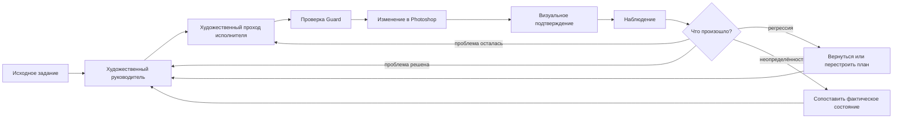
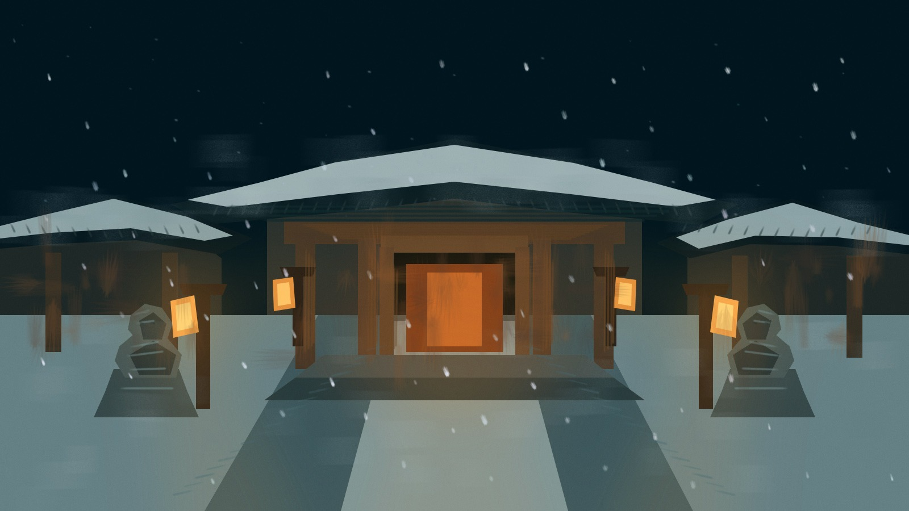
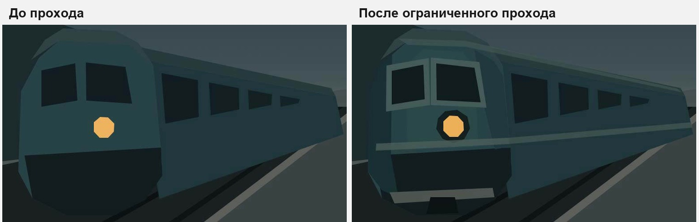
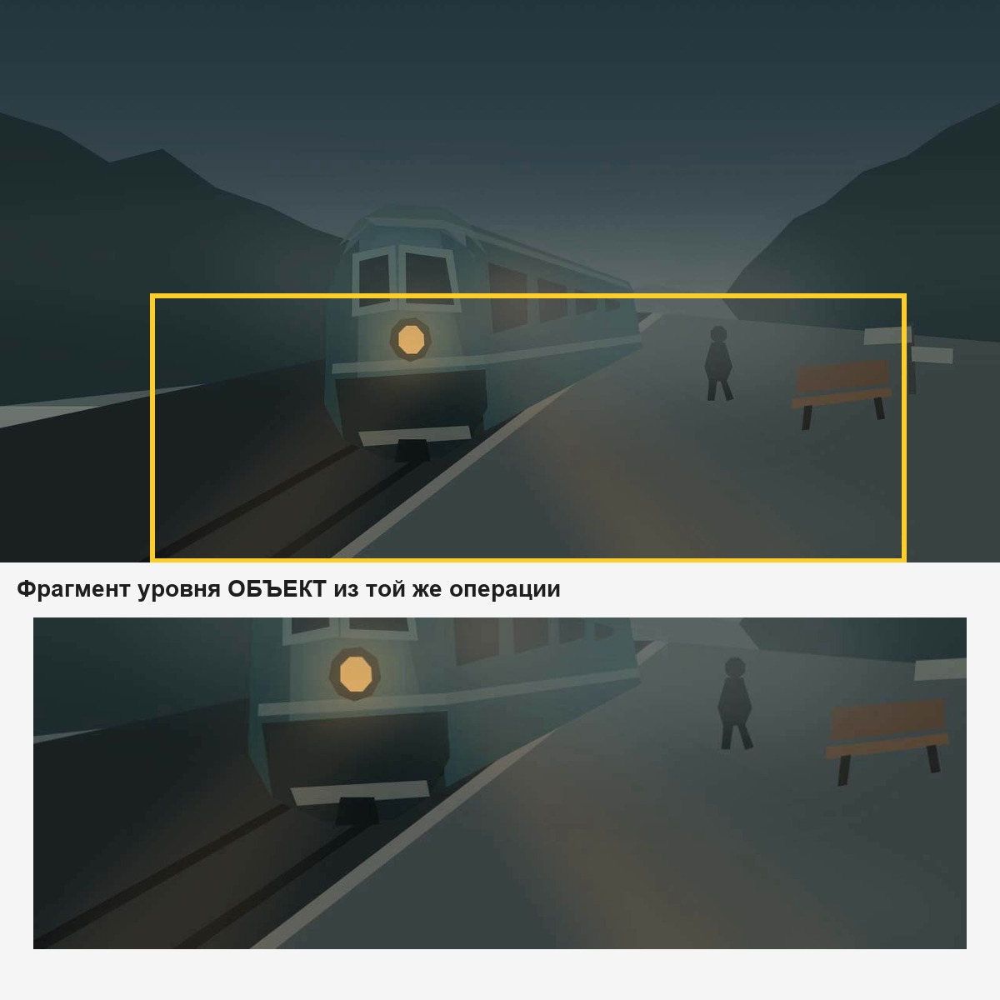

# Как работает система

## Коротко

Digital Painting Edition рассматривает Photoshop не как безличный набор команд, а как внешний редактор с долговременным состоянием. Каждое действие изменяет реальный документ, после чего агент должен заново убедиться, что именно произошло.



Главная идея: **следующее действие определяется не тем, что агент собирался сделать, а тем, что он смог подтвердить после предыдущего действия**.

## 1. Исходное задание превращается не в список команд

Пользователь может сказать:

> Нарисуй тихий заснеженный храм ночью.

Наивный агент легко превращает это в список объектов:

- крыша;
- фонарь;
- снег;
- статуя;
- небо.

Но наличие объектов ещё не образует цельную сцену.

Художественный руководитель (внутреннее имя роли — `Art Director`) сначала определяет более устойчивые отношения:

- где находится главная зона внимания;
- какие большие светлые и тёмные массы определяют кадр;
- какая глубина сцены;
- что должно читаться первым;
- какие признаки обязательны для узнаваемости;
- какие уже достигнутые качества нельзя случайно разрушить.

Так текстовое задание превращается в **визуальную задачу**, а не в перечень предметов.



*В этой сцене важны не просто «крыши, снег, фонари и статуи». Цельность создают отношения: центральный тёплый акцент, холодная снежная среда, симметрия, глубина двора и подчинённые боковые массы.*

## 2. Художественный руководитель и исполнитель решают разные задачи

### Художественный руководитель

Отвечает за общий уровень:

- интерпретацию исходного задания;
- текущий этап работы;
- приоритет проблем;
- смену стратегии;
- границы локальной автономии;
- решение о необходимости общей повторной оценки.

### Исполнитель

Исполнитель (внутреннее имя роли — `Painter`) получает ограниченную задачу, например:

> Укрепить силуэт средней группы построек и отделить её по тону от дальнего плана, не меняя главный световой акцент.

Исполнитель не должен одновременно «улучшать всё изображение». Чем уже причинная задача, тем легче проверить результат.

## 3. Художественный проход

Один художественный проход (в технических документах — `pass`) — это не один мазок и не целая стадия картины.

Это минимально разумная художественная единица, которую можно проверить как причинное действие.

Примеры:

- собрать крупную теневую массу;
- исправить силуэт объекта;
- отделить два плана по светлотности;
- убрать повторяющийся рисунок отпечатков;
- смягчить группу второстепенных краёв;
- усилить контактную тень.

Внутри проход может состоять из нескольких операций Photoshop, но снаружи остаётся одной художественной гипотезой:

> Если выполнить эти изменения, конкретная визуальная проблема должна стать слабее.



*Один причинный pass в railway-run: слева состояние до моделирования поезда, справа результат ограниченного прохода. Сравнивается не факт вызова инструмента, а конкретное изменение формы.*

## 4. Guard переводит художественный замысел в безопасную операцию

`Guard` — внутреннее имя защитного контроллера. Он не решает, красиво ли изображение. Его задача:

- проверить, что выбран правильный документ;
- проверить допустимость целевых слоёв;
- убедиться, что не осталось незакрытого долга по проверке или восстановлению;
- сохранить точный идентификатор операции;
- не допустить слепого повторения;
- привязать визуальное подтверждение именно к этой операции;
- определить необходимый уровень визуальной проверки;
- сохранить состояние, достаточное для восстановления.

При этом Guard не должен становиться художественным цензором. Если сцена использует перспективную,
световую или цветовую модель, **сам выбор художественной модели принадлежит художественному руководителю**.
Guard отвечает за другое: чтобы уже принятая модель имела явное состояние, не терялась между проходами,
не противоречила сама себе и была перепроверена после структурных изменений.

Например:

- художественный руководитель решает, что сцена намеренно плоская, ортографическая или использует
  экспрессивное искажение;
- геометрические помощники могут вычислить линии, точки схода, опоры и контрольные сечения;
- Guard может потребовать наличие актуальной модели и не пропустить операцию, противоречащую уже принятому
  пространственному контракту;
- но Guard не должен самостоятельно объявлять классическую перспективу единственно допустимым стилем.

Упрощённо:

```text
художественный замысел
→ техническая проверка
→ регистрация операции
→ выполнение
→ точный результат или явно отмеченная неопределённость
→ визуальное подтверждение
```

## 5. UXP и единый рабочий маршрут

Поддерживаемые смысловые операции выполняются через дополнение Photoshop на UXP — современной платформе расширений Adobe.

Смысл этого ограничения не только в технологии. Оно уменьшает неопределённость: если один путь исполнения уже мог начать операцию, система не должна автоматически повторять то же действие другим способом.

Если UXP не готов, лучше получить определённую ошибку **до** изменения документа.

## 6. Визуальное подтверждение после действия

После значимого изменения система получает изображение кадра целиком.

Если вопрос локальный, к нему добавляется фрагмент уровня объекта или микродетали.

Важно: «кадр целиком» не означает, что после каждого прохода из Photoshop выгружается полный исходный
растр документа. Текущий UXP-маршрут запрашивает у Photoshop уменьшенное представление через Imaging API
и задаёт целевой размер. Для больших документов это позволяет проверять композицию на рабочем уменьшенном
кадре, а исходные координаты и размеры холста всё равно сохраняются отдельно. Более крупный локальный
фрагмент запрашивается только тогда, когда он действительно нужен.

Важно, что такой фрагмент относится не просто к «текущей картинке», а к конкретной причинной цепочке:

```text
операция
+ конкретное состояние документа
+ идентификатор кадра целиком
+ область
+ идентификатор фрагмента
```

Это защищает от ситуации, когда старый фрагмент случайно используется для оценки уже изменившейся картины.



*Guard сохраняет общий кадр и при необходимости добавляет локальный фрагмент той же операции. Поэтому объектная проверка не теряет связь с общей композицией.*

## 7. Наблюдение должно описывать визуальный результат

Недостаточно сказать:

> Инструмент сработал.

Нужна формулировка уровня:

> Силуэт стал яснее, но нижняя часть всё ещё сливается с фоном. Локальная проблема уменьшилась, однако задача ещё не закрыта.

Технический результат выполнения и художественный результат остаются разными сущностями.

## 8. Почему это система с состоянием

Photoshop хранит множество состояний:

- активный документ;
- активный слой;
- выделение;
- историю;
- состояние кисти;
- принятые точки возврата;
- незакрытые операции;
- долг по визуальной проверке;
- временные художественные гипотезы.

Поэтому следующее действие должно исходить из **подтверждённого состояния**, а не только из текста предыдущего ответа модели.

## 9. Где принимаются решения

| Уровень | Что решает |
| --- | --- |
| языковая модель | художественную интерпретацию и описание увиденного |
| художественный руководитель | приоритеты и границы задачи |
| исполнитель | конкретный причинный художественный проход |
| геометрические, цветовые и измерительные помощники | детерминированные расчёты и проверяемые отношения |
| компоновщик операции | перевод художественного намерения в исполнимую структуру |
| Guard | соблюдение уже принятого контракта, безопасность, состояние, восстановление и обязательность проверки |
| Photoshop | фактическое изменение документа |
| визуальная проверка | что реально получилось |

Ни один из этих уровней по отдельности не доказывает успех всей художественной операции.

## 10. Почему это интересно не только для Photoshop

Тот же класс задач возникает у агентов, управляющих:

- Blender;
- системами автоматизированного проектирования;
- звуковыми рабочими станциями;
- видеоредакторами;
- средами разработки;
- браузерами;
- другими программами с долговременным состоянием.

Общий вопрос:

> Как должен действовать агент, если внешняя операция может быть дорогой, необратимой или небезопасной для повторения, а наблюдение результата неполно?

Photoshop в этом проекте служит практически сложным полигоном для такой задачи.
