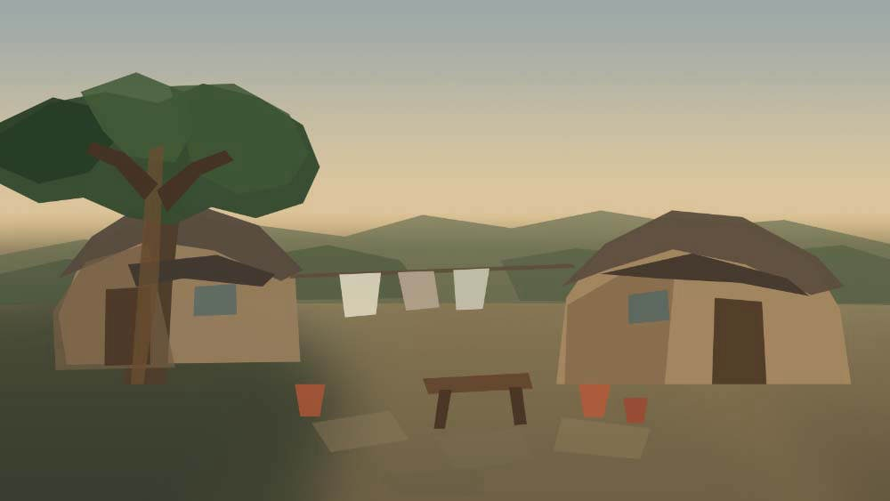
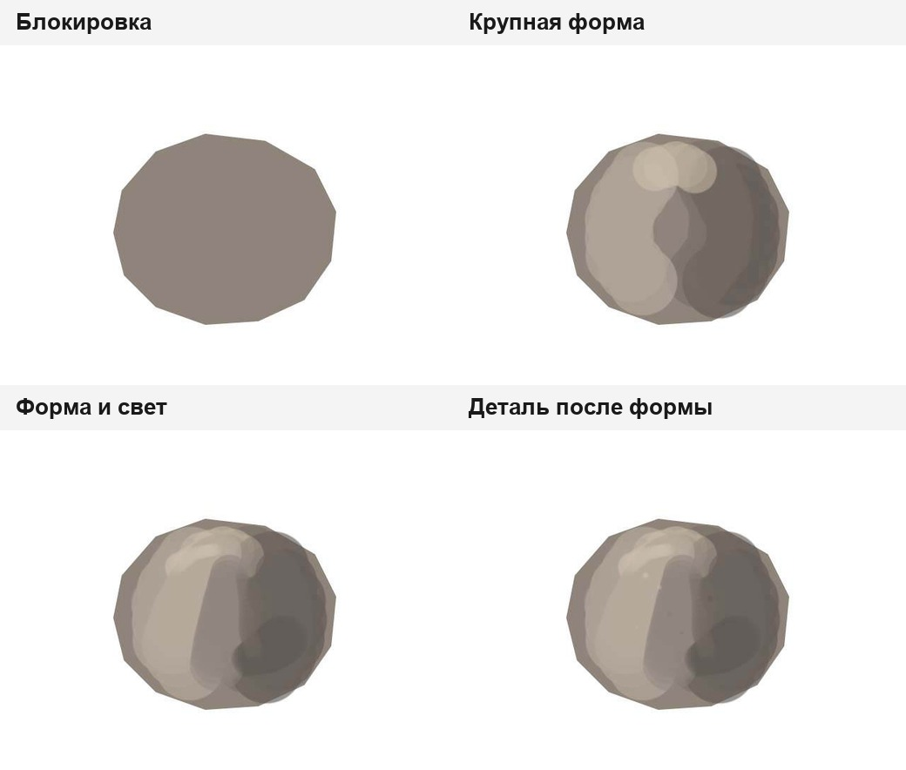
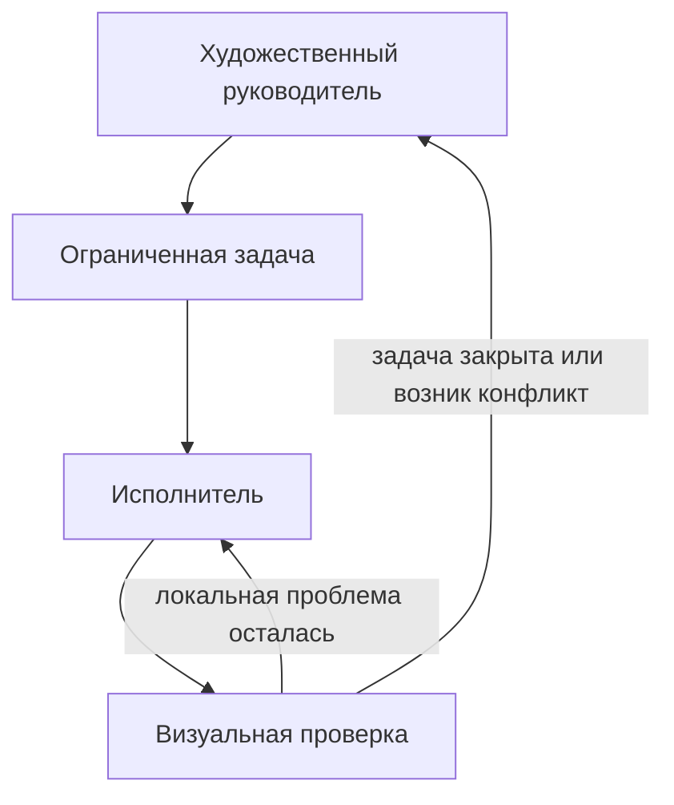
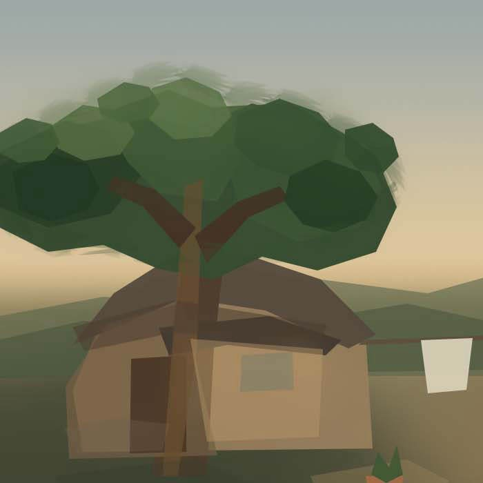

# Методика автономного рисования

## Обратная связь в текущем коде

После прохода [прямо оцени точные BEFORE/AFTER в том же чате](../artistic-evaluator.md) через обычный
review: видимые форма, перспектива и свет относительно исходного задания и стиля. Запиши главный
недостаток в primary_mismatch и исправляй его следующим проходом. При повторном провале меняй построение,
а не добавляй фактуру. «Осталась текстура» не может завершить задачу отсутствующего объёма.
Block-in допускает конструктивную схему; это не готовая реалистическая картина. Локальная модель
автоматически не вызывается; самооценка не является независимой приёмкой или доказательством качества.


## Почему «выполнить объекты из списка» недостаточно

Агент, использующий инструменты, легко попадает в **ловушку примитивов**: технически удобная простая форма начинает восприниматься как доказательство художественного результата.

Если задача — нарисовать дом, наивный план может выглядеть так:

```text
прямоугольник
→ треугольная крыша
→ окна
→ текстура
→ готово
```

Все требуемые объекты присутствуют, но изображение всё ещё может оставаться схемой. Поэтому система оценивает не наличие примитивов, а визуальные отношения.

## 1. Сначала узнаваемость

На ранней стадии важнее всего ответить на вопросы:

- узнаётся ли субъект;
- работает ли композиция;
- верен ли общий масштаб;
- читается ли силуэт;
- различимы ли передний, средний и дальний планы;
- есть ли понятная иерархия зрительных акцентов;
- правильно ли распределены крупные светлые и тёмные массы.

Первичная компоновка, или **блокировка узнаваемости** (`Recognition Block-In`), не обязана быть красивой. Её задача — дёшево проверить фундамент до того, как исправления станут дорогими.



*Ранняя стадия реального homestead-run: дома, крупное дерево, двор и дальние холмы уже читаются как единая сцена, хотя материал, края и мелкая детализация ещё почти не разработаны.*

## 2. Иерархия от крупного к мелкому

Полезная последовательность:

```text
УЗНАВАЕМОСТЬ
→ КОМПОЗИЦИЯ И БОЛЬШИЕ МАССЫ
→ СИЛУЭТ И КОНСТРУКЦИЯ
→ ТОНАЛЬНАЯ ОРГАНИЗАЦИЯ
→ ФОРМА
→ КРАЯ
→ МАТЕРИАЛ
→ ДЕТАЛЬ
→ ОЧИСТКА
```

Это не жёсткий линейный конвейер. Художник может вернуться к более раннему уровню, если поздний проход выявил структурную проблему. Но детализация не должна становиться способом скрыть нерешённую форму.

Живой пример того, как такая обратная связь привела уже не к локальной правке изображения, а к пересмотру
самой структуры процесса, разобран отдельно: [Как живой тест изменил процесс: перспектива и цвет](process-revision-perspective-color.md).

## 3. Текстура не равна развитию формы

Рассмотрим два варианта изменения одного плоского наброска.

### Только текстура

Добавлены шум, мелкие мазки, царапины, узоры и дополнительные края, но крупная форма не стала убедительнее.

### Развитие формы

Изменились вторичные плоскости, поворот формы в пространстве, иерархия краёв, контакт с опорой и реакция материала на свет.

Второй вариант может содержать меньше новых пикселей, но быть сильнее художественно. Поэтому проект отделяет **добавление деталей** от **развития формы**.



*Контролируемое упражнение Task 23. Сначала существует только плоская масса; затем появляются крупные плоскости, свет и края. Мелкая деталь допускается только после того, как форма уже читается.*

## 4. Причинный художественный проход

Хороший проход формулируется как проверяемая гипотеза.

> Правая стена здания сливается с фоном. Сделать её локально теплее и немного светлее, сохранив силуэт крыши и главный контраст у фонаря.

Здесь есть:

- конкретная проблема;
- предполагаемая причина;
- ограниченное изменение;
- защищаемое достижение;
- ожидаемый визуальный эффект.

Фраза «добавить деталей зданию» причинной гипотезы почти не содержит.

## 5. Художественный руководитель и исполнитель

Художественный руководитель (`Art Director`) отвечает за:

- интерпретацию исходного задания;
- глобальные приоритеты;
- текущий этап;
- границы задачи;
- смену стратегии;
- момент общей повторной оценки.

Исполнитель (`Painter`) получает ограниченную задачу и выполняет внутри неё несколько проверяемых художественных проходов.



Так локальная автономия не превращается в длинную цепочку изменений без глобального контроля.

## 6. Метод выбирается по визуальной проблеме

Проект не сводит рисование к мазкам кисти.

В зависимости от задачи могут быть уместны:

- кисть, карандаш, ластик, размазывание;
- заливка ограниченной области;
- выделения и маски;
- трансформации;
- градиенты;
- корректирующие слои;
- компоновка нескольких элементов;
- размытие и повышение резкости;
- операции со слоями;
- отпечатки сложной формы;
- другие зарегистрированные возможности Photoshop.

Критерий:

> Какой метод причинно подходит к наблюдаемой проблеме?

а не:

> Какой инструмент проще всего вызвать?

## 7. Кисть должна иметь наблюдаемую роль

Имя набора или кисти — слабое доказательство её художественного поведения.

Кисть с названием «Oil» не обязательно хорошо подходит для построения широкой плоскости, а нейтрально названная кисть может давать полезный рваный край.

Поэтому для наборов кистей используется профилирование по фактическому следу:

```text
кисть
→ ограниченная проба
→ реальный отпечаток
→ визуальное подтверждение
→ наблюдаемые свойства
→ художественная роль
```

Роль должна следовать из фактического следа, а не только из названия.


*Проба из реального Photoshop-run: слева направленный жёсткий след, справа мягкий зернистый. Именно наблюдаемое поведение, а не имя пресета, определяет полезную художественную роль кисти.*

## 8. Отпечаток — полезный инструмент и отдельный риск

Сложный отпечаток (`stamp`) способен быстро дать декоративный или фактурный мотив, но повтор одного и того же контура легко создаёт механическое ощущение копирования.

Поворот, масштабирование и изменение цвета сами по себе не всегда достаточно меняют зрительную тождественность экземпляров.

Поэтому важны:

- различие экземпляров;
- контроль повторяемости;
- частичное перекрытие;
- последующая дорисовка;
- разнообразие краёв;
- интеграция с окружающей формой.



*Фрагмент homestead-run, где работа с краем кроны показывает риск механического повторения сложных отпечатков. Такой pass имеет смысл оценивать локально, но обязательно в контексте всей формы дерева.*

## 9. Стабильные достижения и точки возврата

По ходу работы некоторые качества становятся достигнутыми:

- читающийся силуэт;
- сильная композиционная масса;
- правильное распределение слоёв;
- иерархия зрительных акцентов;
- удачное принятое состояние изображения.

Следующий проход не должен считать их бесплатными. Они могут стать защищаемыми ограничениями или **точкой возврата** — состоянием, к которому можно вернуться при ухудшении результата.


*Слева — неудачная перестройка дерева, которая добавила заметные механические элементы. Справа — проверенный возврат к ранее принятому состоянию вместо попытки бесконечно исправлять слабую гипотезу поверх неё.*

## 10. Завершённость — это состояние, а не конец списка команд

Работа не считается законченной только потому, что:

- выполнены все запланированные вызовы;
- последний инструмент вернул успех;
- холст заполнен;
- деталей стало много;
- закончился лимит времени.

Финальное состояние должно закрывать существенные визуальные долги: исходное задание читается, критические проблемы устранены, крупная структура сохранена, детали поддерживают форму, обязательная проверка выполнена и существует проверенная точка сохранения.

## 11. Что здесь является правилом системы, а что гипотезой

Привязку к документу, обязательность проверки, происхождение визуального подтверждения и защитные ограничения можно проверять машинно.

Но утверждение «эта последовательность стадий всегда даёт художественно лучший результат» было бы слишком сильным.

Поэтому методику нужно проверять:

- на контролируемых упражнениях;
- на специально подобранных отрицательных примерах;
- на новых задачах, не использовавшихся при настройке метода;
- на реальных запусках Photoshop;
- с помощью независимой человеческой оценки там, где речь идёт о художественном качестве.

Возможность опровергнуть метод полезнее рекламного заявления о «правильном способе рисования».
