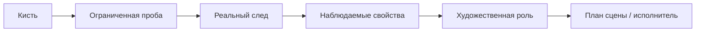
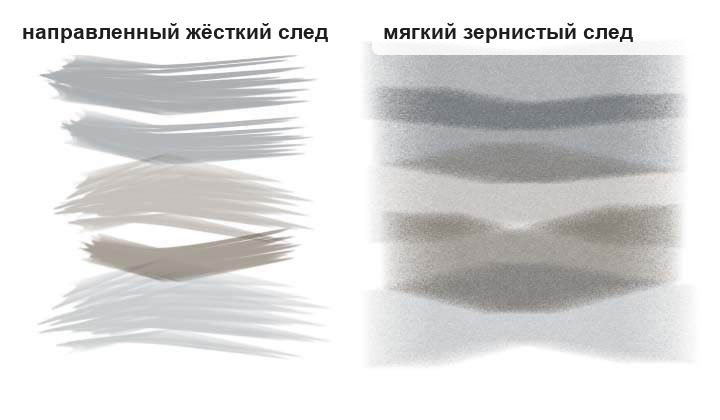
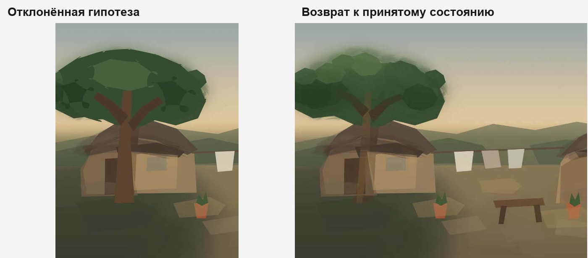

# Память и адаптация во время работы

## Привязка независимой оценки

[Машинная оценка](../artistic-evaluator.md) хранится с операцией и точным кадром; смена исходного задания,
стадии, контракта или экземпляра документа снимает её прежнюю применимость. Повтор review того же
кадра использует результат без повторного inference. Это память наблюдения, а не обучение модели
или доказательство повышения качества. Статусы unavailable/invalid остаются неопределённостью.


## Это не дообучение модели

Термин «самообучение» легко создаёт неправильное впечатление.

Digital Painting Edition не меняет веса базовой языковой модели во время рисования и не заявляет, что выполняет её дополнительное обучение.

Более точная формулировка:

> **Адаптация во время работы через структурированное состояние и подтверждённую опытом память.**

То есть система меняет следующее действие на основе того, что уже произошло в текущей работе, не переобучая саму модель.

## 1. Что можно запоминать

### Состояние задачи

- исходное задание;
- текущую задачу художественного руководителя;
- этап работы;
- нерешённые проблемы;
- защищаемые достижения;
- текущую точку возврата.

### Историю стратегий

Например:

```text
проблема: передний план сливается по силуэту

стратегия A:
затемнить фон
результат: проблема осталась

стратегия B:
отделить передний план по светлотности
результат: частичное улучшение
```

Следующая попытка не должна механически повторять стратегию A.

### Состояние возможностей

- готовность UXP;
- доступные методы;
- состояние кистей;
- выбранный документ;
- устойчивые целевые слои.

### Визуальные подтверждения

- точный идентификатор кадра;
- области проблем;
- локальные фрагменты;
- принятые и ухудшенные состояния.

## 2. Память о поведении кистей

Имя кисти — это метаданные, а не художественная истина.

Надёжнее такой путь:



Можно оценивать:

- характер края;
- форму отпечатка;
- плотность фактуры;
- направленность;
- пригодность для больших масс;
- пригодность для краёв;
- пригодность для фактуры;
- пригодность для повторяющегося мотива.

Так система адаптируется к реально установленному набору кистей, а не к абстрактному списку названий.



*Реальные пробные следы из Photoshop. Такой визуальный профиль можно сохранить как рабочее знание о поведении кисти: характер края, направленность, зернистость и пригодность для конкретной роли.*

## 3. Профили отпечатков

Сложный отпечаток имеет отдельные свойства:

- форма;
- ориентация;
- допустимое зеркальное отражение;
- масштаб;
- предполагаемое применение;
- риск заметного повторения.

Поэтому такой профиль полезно хранить отдельно от обычной роли кисти.

## 4. Отрицательная память

Память не должна состоять только из «удачных рецептов».

Полезно помнить:

- недавно использованные типы сюжетов;
- неудачные стратегии;
- проблемные сочетания кисти и задачи;
- состояния восстановления;
- повторяющиеся нерешённые циклы.

Это помогает избегать повторения, не превращая память в каталог любимых решений.

Часть этой идеи уже реализована в текущем Guard. Для одной и той же нерешённой проблемы журнал
восстанавливает историю провалившихся попыток и сравнивает новую попытку с предыдущими причинными
стратегиями.

Система уже умеет различать:

- действительно другой причинный подход;
- простой параметрический вариант прежней стратегии;
- две исчерпанные разные стратегии;
- ограниченную попытку перейти на более высокий причинный уровень;
- окончательно заблокированную зависимую проблему.

Поэтому пример ниже — не только желаемая модель:

~~~text
стратегия A не помогла
→ вариант A' с другим цветом/прозрачностью не считается новым решением
→ требуется стратегия B
→ после двух разных неудач требуется объяснить более глубокую причину
→ после неудачи причинного пересмотра проблема возвращается художественному руководителю
~~~

Это важное различие между «памятью в тексте разговора» и долговременным состоянием самого контроллера.

## 5. Почему нельзя запоминать геометрию конкретной сцены как общее знание

Допустим, удачная работа использовала:

```text
вершина крыши = (742, 318)
окно = 120×80
```

Если сохранить это как универсальный опыт, следующая сцена рискует повторить случайную геометрию предыдущей.

Переносимое наблюдение:

> При маленьком размере эта кисть даёт зубчатый край.

Непереносимое:

> Крышу нужно начинать в координате 742,318.

Это граница между **переносимым знанием о методе** и **запомненным решением одной задачи**.

## 6. Точки возврата как оперативная память

Точка возврата означает:

> Это состояние уже было признано достаточно сильным, чтобы к нему можно было вернуться.

```text
A принято
→ B эксперимент
→ B стало хуже
→ возврат к A
```

Такой механизм позволяет исследовать варианты, не превращая каждую ошибку в необратимую.



*Слева — экспериментальное состояние, признанное слабее; справа — возврат к ранее принятой версии. В этом смысле принятая точка возврата работает как оперативная память о состоянии, которое уже заслужило сохранение.*

## 7. Исчерпание стратегии

Если одна и та же проблема переживает несколько попыток, система должна менять причинный подход или остановиться.

Плохой цикл:

```text
проблема: лицо плоское

попытка 1: добавить текстуру
→ не решено

попытка 2: ещё текстура
→ не решено

попытка 3: ещё текстура
→ цикл
```

Более здоровая смена стратегии:

```text
пересобрать тональные плоскости
→ изменить иерархию краёв
→ снова проверить форму
```

Повтор с небольшими случайными отличиями — не обучение.

В текущей реализации это уже не только рекомендация исполнителю. Guard способен заблокировать повтор
исчерпанной причинной стратегии и потребовать либо действительно отличающийся подход, либо переход на
диагностику корневой причины.

## 8. Что могло бы стать настоящим обучающим слоем в будущем

Отдельный межзапусковый слой мог бы собирать статистику по множеству работ:

- предварительные ожидания о поведении кистей;
- повторяющиеся типы ошибок;
- эффективность методов для разных классов проблем;
- результаты независимой оценки;
- устойчивые предпочтения пользователя.

Но это уже потребует отдельной методологии:

- границ набора данных;
- происхождения данных;
- конфиденциальности;
- разделения обучения и проверки;
- новых контрольных задач;
- защиты от запоминания конкретных сцен;
- версионирования накопленного опыта.

До появления такого слоя корректнее говорить об **адаптации во время работы**, а не о самообучении модели.

## 9. Почему структурированное состояние полезнее бесконечной истории диалога

Для следующего шага часто важнее знать:

- активную проблему;
- результат предыдущей стратегии;
- выбранный документ и слои;
- текущую принятую точку;
- долг по визуальной проверке;

чем перечитывать десятки страниц свободного разговора.

Это более общий вывод: для агента, управляющего программой с состоянием, предметная структурированная память может быть полезнее простого увеличения длины контекста.
