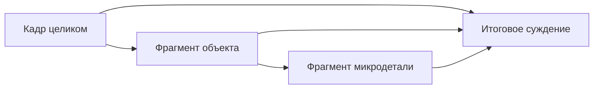

# Адаптивная визуальная проверка

[English](../en/visual-verification.md) · [Русское оглавление](README.md)

## Кто формирует художественную оценку

В текущем коде обычный review просит [самого рисовальщика](../artistic-evaluator.md) прямо оценить
доставленные BEFORE/AFTER относительно исходного задания и стиля. Видимые свойства записываются в observed,
главный недостаток — в primary_mismatch; следующий проход исправляет его через изменение построения.
Автоматического вызова локальной модели нет. Это самооценка, не независимая приёмка. Доставка изображения
остаётся отдельным фактом; SHA и заполненные поля не подтверждают объём или качество. Неопределённость
остаётся явной; доказательство улучшения следующей картины ещё нужно.

При обязательной оценке всей сцены роль Critic того же чата отдельно
проверяет соответствие заданию, форму, свет, композицию и контакт.
Совпавший SHA-256 означает идентичность доставленного файла,
а не правильность оценок. Для помещающегося набора изображений
`photoshop_guard_cycle_auto` передаёт их inline; явный
`photoshop_guard_review_image` нужен только для недоставленных ролей.


## Одного изображения недостаточно для всех вопросов

Пусть агент изменил картину размером 4000×3000 пикселей.

Для оценки композиции полезен весь кадр.

Для оценки силуэта головы нужен более крупный фрагмент.

Для оценки ореола шириной четыре пикселя изображение всей картины почти бесполезно.

Поэтому «получить снимок после каждого действия» ещё не является полноценной стратегией визуальной проверки.

## 1. Три уровня наблюдения

### КОМПОЗИЦИЯ

Вопросы:

- читается ли вся сцена;
- где находится главный зрительный акцент;
- работают ли большие массы;
- не разрушил ли локальный проход общий баланс;
- сохраняется ли глубина.

Основные данные: кадр целиком.

### ОБЪЕКТ

Вопросы:

- правильный ли силуэт;
- узнаётся ли объект;
- работают ли пропорции;
- есть ли убедительный контакт с опорой;
- корректны ли перекрытия и глубина.

Данные: кадр целиком + ограниченный фрагмент объекта.

### МИКРОДЕТАЛЬ

Вопросы:

- есть ли шов;
- есть ли ореол;
- разорван ли край;
- появился ли небольшой артефакт;
- заметно ли механическое повторение;
- есть ли локальный скачок тона или цвета.

Данные: кадр целиком + контекстный фрагмент + при необходимости очень локальный фрагмент.


*Реальные Guard-артефакты одной операции. Сверху сохраняется общий вид сцены; жёлтая рамка показывает запрошенную область. Ниже — отдельный фрагмент уровня ОБЪЕКТ. Локальный просмотр добавляет данные, но не заменяет кадр целиком.*

## 2. Кадр целиком сохраняется всегда

Очень привлекательная ошибка:

> Если проблема маленькая, будем смотреть только увеличенный фрагмент.

Но локальный фрагмент меняет восприятие контекста.

Край может выглядеть великолепно при сильном увеличении и оказаться чрезмерно резким в общей композиции.

Поэтому локальная проверка **добавляет** информацию к кадру целиком, а не заменяет его.

В текущей реализации кадр целиком обычно является **уменьшенным рабочим представлением**, а не
полноразмерной копией всех пикселей документа. UXP запрашивает изображение через Photoshop Imaging API
с заданным целевым размером. Это особенно важно для документов 4K и больше: композиционная проверка не
должна без необходимости оплачивать передачу и кодирование полного исходного растра.

Если требуется локальная проверка, система отдельно запрашивает фрагмент нужной области с собственным
ограничением размера. Таким образом архитектура уже использует гибридный принцип:

~~~text
уменьшенный кадр целиком
→ при необходимости более подробный локальный фрагмент
→ исходные координаты документа сохраняются отдельно
~~~



## 3. Координатные пространства не смешиваются

У системы есть несколько разных пространств координат. Они не должны подменять друг друга.

### Пространство документа

Это каноническая система Guard:

~~~text
(0, 0) ─────────────→ X
   │
   │
   ↓
   Y
~~~

Координаты относятся к холсту Photoshop и выражаются в пикселях исходного документа.

### Пространство слоя

Отдельный слой может быть сдвинут, трансформирован, повёрнут или находиться внутри Smart Object.
Его локальная геометрия не становится канонической системой для визуального контракта.

Если операция работает с локальными данными слоя, преобразование в пространство документа должно быть
явным.

### Пространство уменьшенного изображения

Например:

~~~text
документ: 4000×3000
уменьшенный кадр: 1000×750
~~~

Координаты уменьшенного изображения никогда не должны записываться как координаты исходной сцены.

Текущий UXP-код учитывает также внутренний уровень изображения, который Photoshop может вернуть при
уменьшенном чтении: фактические границы пересчитываются обратно через коэффициент уровня перед тем, как
сопоставляться с исходным холстом.

### Пространство интерфейса

Масштаб просмотра Photoshop, панорамирование и поворот вида относятся только к пользовательскому
интерфейсу. Они не должны менять смысл координат Guard.

Поэтому область проверки всегда задаётся в пространстве исходного документа Photoshop.

Например:

```text
left = 1200
top = 600
right = 1800
bottom = 1300
```

Эти числа должны означать одну и ту же область независимо от размера уменьшенного изображения.

Иначе ошибка масштаба превращается в ошибку художественной логики.

## 4. Локальный фрагмент должен иметь происхождение

Фрагмент — не просто JPEG-картинка.

Он должен быть связан с:

- конкретной операцией;
- конкретным состоянием документа;
- кадром целиком;
- запрошенной областью;
- фактически полученной областью;
- уровнем проверки;
- собственным идентификатором.

Если кадр целиком уже изменился, старый локальный фрагмент нельзя автоматически считать актуальным.

## 5. Дополнительная проверка должна быть только читающей

Предположим, после художественного прохода кадра целиком недостаточно.

Нельзя отвечать:

> Выполним тот же проход ещё раз и посмотрим получше.

Правильная последовательность:

```text
изменение выполнено один раз
→ получен кадр целиком
→ наблюдение: данных недостаточно
→ получен локальный фрагмент ОБЪЕКТА
→ при необходимости получен фрагмент МИКРОДЕТАЛИ
→ вынесено суждение
```

Художественное изменение остаётся тем же самым и не повторяется.

## 6. Максимальное разрешение не является целью

Большее изображение:

- передаёт больше данных;
- занимает больше контекста модели;
- может отвлекать внимание;
- не помогает глобальному вопросу;
- не создаёт информации сверх исходного документа.

Цель:

> Получить минимально достаточное визуальное подтверждение для конкретного решения.

Текущая реализация уже следует этому правилу частично: общий кадр запрашивается в ограниченном целевом
размере, а локальный фрагмент получает собственный предел размера. Отдельной инженерной задачей остаётся
точнее измерить стоимость этапов получения пикселей, кодирования и передачи, чтобы не смешивать время
Photoshop-операции со стоимостью визуального подтверждения.

Ещё одна важная деталь текущей реализации: чтение preview сейчас выполняется UXP-кодом внутри
`executeAsModal` под отдельной командой чтения. Это зафиксированный рабочий путь, а не доказательство того,
что Imaging API обязательно требует модального режима для любого чтения. Возможный вынос безопасного
чтения за пределы модального участка следует рассматривать только как отдельный живой эксперимент и
оптимизацию, а не как уже существующее свойство архитектуры.

## 7. Структурированное описание проблемы

Если системе нужен более локальный просмотр, фразы «посмотри поближе» недостаточно.

Полезнее запись вида:

```text
тип проблемы: ореол на шве
область: точные координаты исходного документа
требуемый уровень: МИКРОДЕТАЛЬ
```

Тогда Guard может однозначно получить нужный фрагмент для той же операции.

## 8. Создание изображения, доставка модели и понимание — разные вещи

Есть три разных утверждения:

1. изображение или файл действительно создан;
2. именно этот файл был передан модели;
3. модель сформировала по нему содержательное наблюдение.

Путь и контрольная сумма могут доказать первое. Данные транспорта — второе. Третье нельзя честно заменить флажком «изображение понято».

Такое разделение делает систему наблюдаемой без лишних заявлений.

## 9. Как сравнивать стратегии проверки

Полезно сравнить три режима.

### Только общий вид

После каждого прохода проверяется только кадр целиком.

### Всегда всё

После каждого прохода всегда передаются общий вид, объект и микродеталь.

### Адаптивный режим

Кадр целиком передаётся всегда, а локальные фрагменты — только если этого требует область изменения или возникшая неопределённость.

Сравнивать можно:

- пропущенные дефекты;
- ложные срабатывания;
- глобальные ухудшения после локальной коррекции;
- объём переданных изображений;
- число дополнительных фрагментов;
- число повторных изменений;
- согласие с человеческой оценкой.

## 10. Где заканчивается машинное доказательство

Система может доказать:

- правильность координат области;
- актуальность фрагмента;
- связь с конкретной операцией;
- отсутствие повторного изменения;
- факт доставки изображения;
- закрытие обязательного этапа проверки.

Но вопрос:

> Стал ли портрет убедительнее?

остаётся художественным суждением.

Для него нужна оценка человеком или специально откалиброванным независимым оценщиком. Это не недостаток тестирования, а правильная граница между техническим доказательством и художественным выводом.
